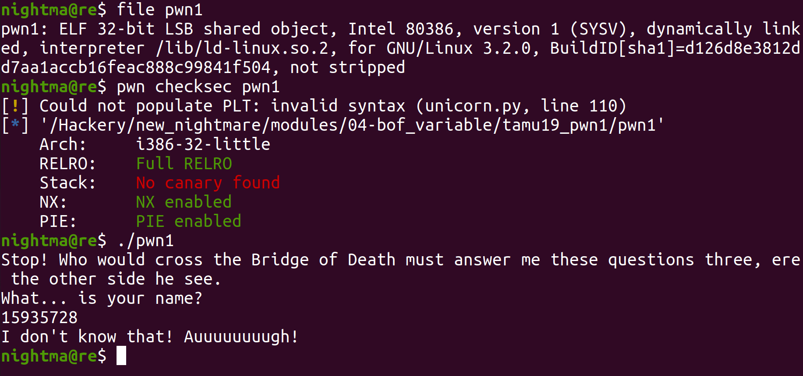
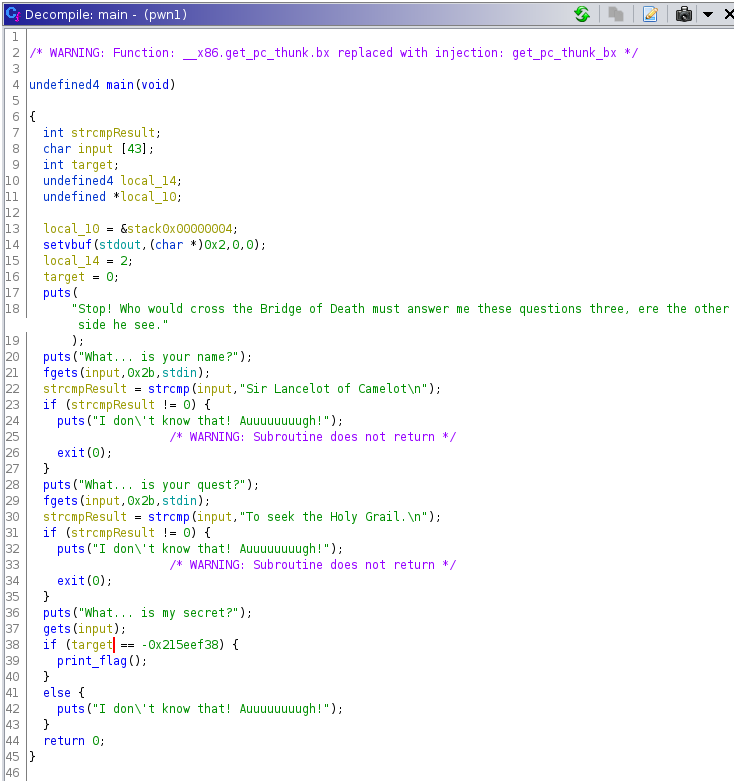
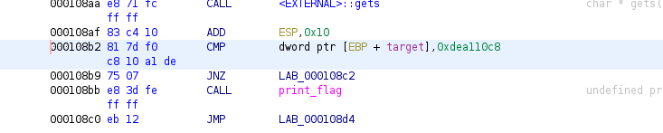
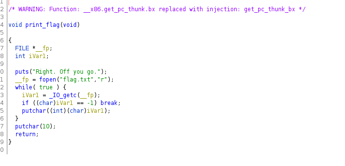
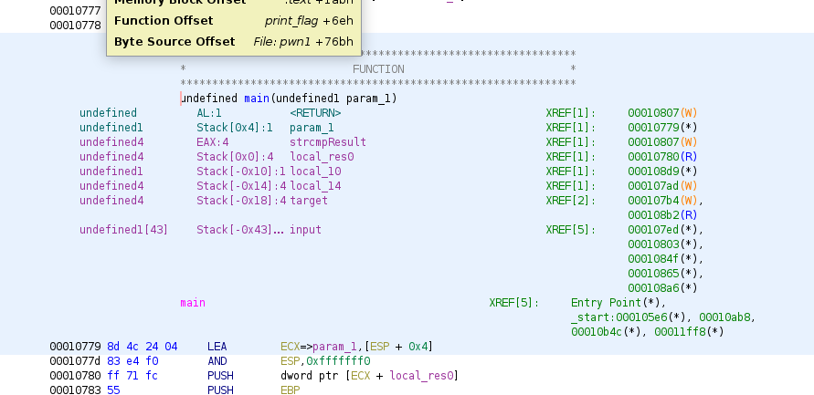
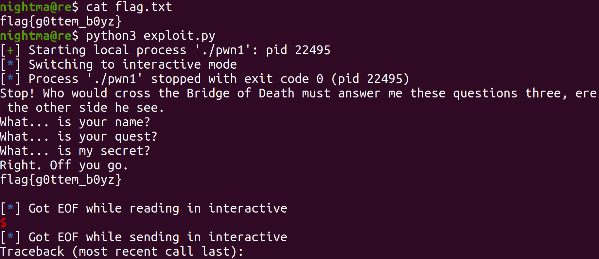

# Tamu19 pwn1

This was done on `Ubuntu 20.04.4`, although the exact ubuntu version probably doesn't matter too much for this one.

Let's take a look at the binary:




So we can see that it is a `32` bit binary with RELRO, a Non-Executable Stack, and PIE (those binary mitigations will be discussed later). We can see that when we run the binary, it prompts us for input, and prints some text. When we take a look at the main function in Ghidra we see this:



So right off the back, we can see we are dealing with a reference to one of the greatest movies ever (Monty Python and the Holy Grail). We can see that it will scan in input into `input` using `fgets`, then compares our input with `strcmp`. It does this twice. The first time it checks for the string `Sir Lancelot of Camelot\n` and the second time it checks for the string `To seek the Holy Grail.\n`. If we don't pass the check the first time, it will print `I don\'t know that! Auuuuuuuugh!` and exit. For the second check if we pass it, the code will call the function `gets` with `input` as an argument. The function `gets` will scan in data until it either gets a newline character or an EOF. As a result on paper there is no limit to how much it can scan into memory. Since the are it is scanning into is finite, we will be able to overflow it and start overwriting subsequent things in memory.

Also, looking below it, we see there is an if then statement comparing the stack variable `target` to `0xdea110c8`. In earlier versions of ghidra, the decompiled code did not show this correctly, and you had to see it in the assembly code. This check happens around `0x000108b2`:



Seeing that if the check is passed, the `print_flag` (`0x00106fd`) function is called, we will probably want to pass that check to call the function. Looking at the decompiled code for `print_flag`, we see that it prints the contents of `flag.txt`:



So if we can use the `gets` call to overwrite the contents of `target` to `0xdea110c8`, we should get the flag (if you're running this locally you will need to have a copy of `flag.txt` that is in the same directory as the binary). So in order to reach the `gets` call, we will need to send the program the string `Sir Lancelot of Camelot\n` and `To seek the Holy Grail.\n`. Looking at the stack layout in Ghidra (we can see it by double clicking on any of the variables in the variable declarations for the main function, or in the assembly code, scrolling up to the top of the main function) shows us the offset between the start of our input and `target`:




So we can see that `input` starts at offset `-0x43`. We see that `target` starts at offset `-0x18`. This gives us an offset of `0x43 - 0x18 = 0x2b` between the start of our input and `target`. Then we can just overflow it (write more data to a region than it can hold, so it spills over and starts overwriting subsequent things in memory) and overwrite `target` with `0xdea110c8`. Putting it all together we get the following exploit:

```
# Import pwntools
from pwn import *

# Establish the target process
target = process('./pwn1')

# Make the payload
payload = b""
payload += b"0"*0x2b # Padding to `local_18`
payload += p32(0xdea110c8) # The value we will overwrite local_18 with, in little endian

# Send the strings to reach the gets call
target.sendline(b"Sir Lancelot of Camelot")
target.sendline(b"To seek the Holy Grail.")

# Send the payload
target.sendline(payload)

target.interactive()
```

When we run it:



Just like that, we got the flag!
