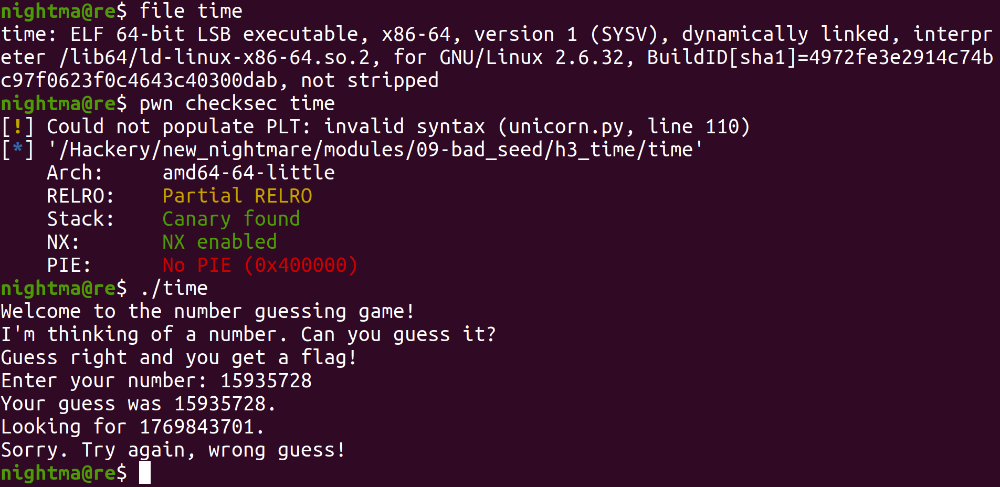
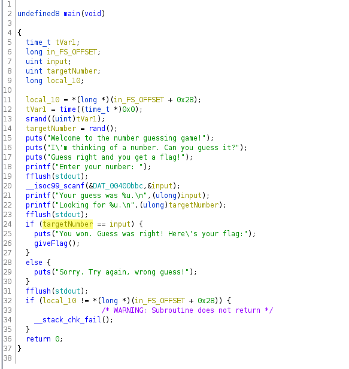
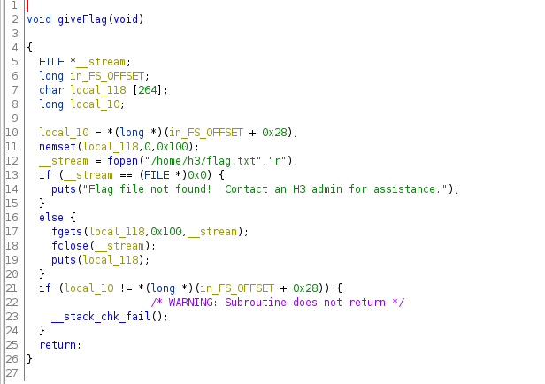
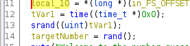

#	h3 time

This was done on `Ubuntu 20.04.4 LTS`, although the exact version probably doesn't matter for this challenge.

Let's take a look at the binary:



So we can see that we are dealing with a 64 bit binary. When we run it, it prompts us to guess a number. When we take a look at the main function in Ghidra, we see this:



So we can see it generates a random number using the `rand` function. It then prompts us for input using `scanf` with the `%u` format string stored in `fDAT_00400bb` (double click on `DAT_00400bb` in the assembly to see it). Then it checks if the two number are the same, and if they are it will run the `giveFlag` function which when we look at it, we can see that it reads prints out the flag file from `/home/h3/flag.txt`:




So we need to figure out what the output of the `rand` function will be. Thing is the output of the `rand` function is not actually random. The output is based off a value called a seed, which it uses to determine what number sequence to generate. So if we can get the same seed, we can get `rand` to generate the same sequence of numbers. Looking at the decompiled code, we see that it uses the current time as a seed (around `0x0040094e`):



So if we just write a simple C program to use the current time as a seed, and output a digit and redirect the output to the target, we will solve the challenge:

```
#include<stdio.h>
#include<time.h>
#include<stdlib.h>
#include<stdint.h>
#include<string.h>

int main()
{
    uint32_t rand_num;
    srand(time(0)); //seed with current time
    rand_num = rand();
    uint32_t ans;
    printf("%d\n", rand_num);	
}
```

When we compile and run it:

```
$	cat solve.c 
#include <stdio.h>
#include <stdlib.h>
#include <stdint.h>
#include <time.h>

int main()
{
    uint32_t rand_num;
    srand(time(0)); 
    rand_num = rand();
    uint32_t ans;
    printf("%d\n", rand_num);	
}
$	gcc solve.c -o solve
$	./solve | ./time 
Welcome to the number guessing game!
I'm thinking of a number. Can you guess it?
Guess right and you get a flag!
Enter your number: Your guess was 1075483710.
Looking for 1075483710.
You won. Guess was right! Here's your flag:
Flag file not found!  Contact an H3 admin for assistance.
```

We can see that we solved it. It didn't print the flag since the file `/home/h3/flag.txt` does not exist, however it prints out an error message seen in the `giveFlag` function so we know that we solved it.
