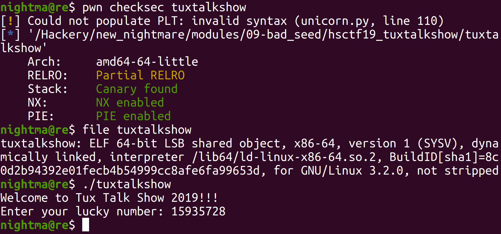

# hsctf 2019 tux talk show

This was done on `Ubuntu 20.04.4 LTS`, although the exact version probably doesn't matter for this challenge.

Let's take a look at the binary:



```
$	pwn checksec tuxtalkshow 
[*] '/Hackery/pod/modules/bad_seed/hsctf19_tuxtalkshow/tuxtalkshow'
    Arch:     amd64-64-little
    RELRO:    Partial RELRO
    Stack:    Canary found
    NX:       NX enabled
    PIE:      PIE enabled
$	file tuxtalkshow 
tuxtalkshow: ELF 64-bit LSB shared object, x86-64, version 1 (SYSV), dynamically linked, interpreter /lib64/l, BuildID[sha1]=8c0d2b94392e01fecb4b54999cc8afe6fa99653d, for GNU/Linux 3.2.0, not stripped
$	./tuxtalkshow 
Welcome to Tux Talk Show 2019!!!
Enter your lucky number: 15935728
```

So we can see that we are dealing with a 64 bit binary with PIE enabled. When we run it, it prompts us for a number. When we look at the `main` function we see this:

```
undefined8 main(void)

{
  int randVal;
  time_t time;
  basic_ostream *this;
  long in_FS_OFFSET;
  int input;
  int j;
  int targetNumber;
  int i;
  int array [4];
  basic_string local_248 [32];
  basic_istream local_228 [520];
  long local_20;
  
  local_20 = *(long *)(in_FS_OFFSET + 0x28);
  basic_ifstream((char *)local_228,0x1020b0);
  time = time((time_t *)0x0);
  srand((uint)time);
                    /* try { // try from 0010127e to 001012c0 has its CatchHandler @ 00101493 */
  this = operator<<<std--char_traits<char>>
                   ((basic_ostream *)cout,"Welcome to Tux Talk Show 2019!!!");
  operator<<((basic_ostream<char,std--char_traits<char>> *)this,endl<char,std--char_traits<char>>);
  operator<<<std--char_traits<char>>((basic_ostream *)cout,"Enter your lucky number: ");
  operator>>((basic_istream<char,std--char_traits<char>> *)cin,&input);
  array[0] = 0x79;
  array[1] = 0x12c97f;
  array[2] = 0x135f0f8;
  array[3] = 0x74acbc6;
  j = 0;
  while (j < 6) {
    randVal = rand();
    array[(long)j] = array[(long)j] - (randVal % 10 + -1);
    j = j + 1;
  }
  targetNumber = 0;
  i = 0;
  while (i < 6) {
    targetNumber = targetNumber + array[(long)i];
    i = i + 1;
  }
  if (targetNumber == input) {
    basic_string();
                    /* try { // try from 00101419 to 00101448 has its CatchHandler @ 0010147f */
    operator>><char,std--char_traits<char>,std--allocator<char>>(local_228,local_248);
    this = operator<<<char,std--char_traits<char>,std--allocator<char>>
                     ((basic_ostream *)cout,local_248);
    operator<<((basic_ostream<char,std--char_traits<char>> *)this,endl<char,std--char_traits<char>>)
    ;
    ~basic_string((basic_string<char,std--char_traits<char>,std--allocator<char>> *)local_248);
  }
  ~basic_ifstream((basic_ifstream<char,std--char_traits<char>> *)local_228);
  if (local_20 != *(long *)(in_FS_OFFSET + 0x28)) {
                    /* WARNING: Subroutine does not return */
    __stack_chk_fail();
  }
  return 0;
}
```

So we can see, it starts off by scanning in the contents of `flag.txt` to `local_228`. Proceeding that we see that it initializes an int array with size entries, although the decompilation only shows four. Looking at the assembly code shows us the rest:

```
        001012c1 c7 85 88        MOV        dword ptr [local_280 + RBP],0x79
                 fd ff ff 
                 79 00 00 00
        001012cb c7 85 8c        MOV        dword ptr [local_27c + RBP],0x12c97f
                 fd ff ff 
                 7f c9 12 00
        001012d5 c7 85 90        MOV        dword ptr [local_278 + RBP],0x135f0f8
                 fd ff ff 
                 f8 f0 35 01
        001012df c7 85 94        MOV        dword ptr [local_274 + RBP],0x74acbc6
                 fd ff ff 
                 c6 cb 4a 07
        001012e9 c7 85 98        MOV        dword ptr [local_270 + RBP],0x56c614e
                 fd ff ff 
                 4e 61 6c 05
        001012f3 c7 85 9c        MOV        dword ptr [local_26c + RBP],0xffffffe2
                 fd ff ff 
                 e2 ff ff ff
```

Also we can see that it uses time as a seed. Proceeding that it performs an algorithm where it will generate random numbers (using time as a seed) to edit the values of `array`, then accumulate all of those values and that is the number we are supposed to guess. Since the `rand` function is directly based off of the seed, and since the seed is the time, we know what values the `rand` function will output. Thus we can just write a simple C program that will simply use time as a seed, and just generate the same number that the target wants us to guess. With that, we can solve the challenge!

```
#include <stdio.h>
#include <stdlib.h>
#include <stdint.h>
#include <time.h>

int main()
{
    int array[6];
    int i, output;
    uint32_t randVal, ans;

    srand(time(0)); 


    i = 0;

    array[0] = 0x79;
    array[1] = 0x12c97f;
    array[2] = 0x135f0f8;
    array[3] = 0x74acbc6;
    array[4] = 0x56c614e;
    array[5] = 0xffffffe2;

    while (i < 6)
    {
    	randVal = rand();
    	array[i] = array[i] - ((randVal % 10) - 1);
    	i += 1;
    }

    i = 0;
    output = 0;

    while (i < 6)
    {
    	output = output + array[i];
    	i += 1;
    }


    printf("%d\n", output);	
}
```

With that, we can solve the challenge. In order for this to work, `flag.txt` needs to be in the same directory as the binary `tuxtalkshow`:
```
$	./solve | ./tuxtalkshow 
Welcome to Tux Talk Show 2019!!!
Enter your lucky number: flag{i_need_to_think_of_better_flags}
```

Just like that, we got the flag!