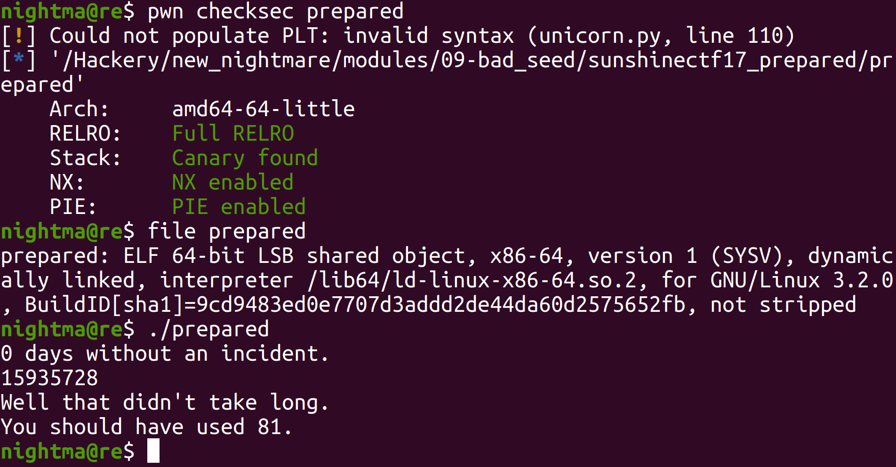
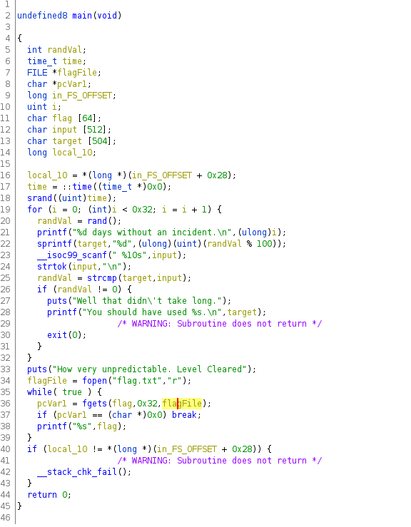

# Sunshine CTF 2017 Prepared

Let's take a look at the binary:



So we can see that we are dealing with a 64 bit binary that prompts us for input. Looking at the main function in Ghidra, we see this:



So we can see, this is pretty similar to the other challenges in this module. It declares time as a seed with the `srand` function, then uses `rand` to generate values (that are modded by 100) that we have to guess in a loop that will run `50` times. So we have to guess what number `rand` will generate 50 times in a row.

Luckily for us, the value `rand` generate is directly based off of the seed. So if we have the same seed, we can generate the same sequence of numbers. Also since the seed is the current time, we know what the seed is. With this we can just write a simple C program which will use time as a seed and generate the numbers it expects:

```
#include <stdio.h>
#include <stdlib.h>
#include <time.h>
#include <string.h>

int main(void)    
{
    int i, out;
    time_t var0 = time(NULL);
    srand(var0);

    for (i = 0; i < 50; i++)
    {
        out = rand() % 100;
        printf("%d\n", out);
    }
    
    return 0;
}
```

When we run it:

```
$   cat solve.c
#include <stdio.h>
#include <stdlib.h>
#include <time.h>
#include <string.h>

int main(void)  
{
  int i, out;
  time_t var0 = time(NULL);
  srand(var0);

  for (i = 0; i < 50; i++)
  {
    out = rand() % 100;
    printf("%d\n", out);
  }
  
  return 0;
}

$   gcc solve.c -o solve
$   ./solve | ./prepared 
0 days without an incident.
1 days without an incident.
2 days without an incident.
3 days without an incident.
4 days without an incident.
5 days without an incident.
6 days without an incident.
7 days without an incident.
8 days without an incident.
9 days without an incident.
10 days without an incident.
11 days without an incident.
12 days without an incident.
13 days without an incident.
14 days without an incident.
15 days without an incident.
16 days without an incident.
17 days without an incident.
18 days without an incident.
19 days without an incident.
20 days without an incident.
21 days without an incident.
22 days without an incident.
23 days without an incident.
24 days without an incident.
25 days without an incident.
26 days without an incident.
27 days without an incident.
28 days without an incident.
29 days without an incident.
30 days without an incident.
31 days without an incident.
32 days without an incident.
33 days without an incident.
34 days without an incident.
35 days without an incident.
36 days without an incident.
37 days without an incident.
38 days without an incident.
39 days without an incident.
40 days without an incident.
41 days without an incident.
42 days without an incident.
43 days without an incident.
44 days without an incident.
45 days without an incident.
46 days without an incident.
47 days without an incident.
48 days without an incident.
49 days without an incident.
How very unpredictable. Level Cleared
isun{pr3d1ct_3very_p[]5s1bl3_scen@r10}
```

Just like that, we got the flag.
